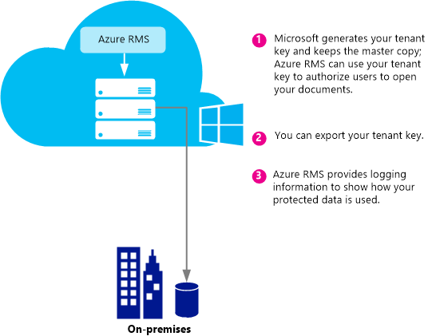
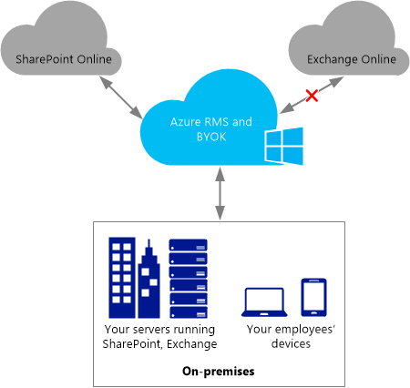

# Tervez&#233;s &#233;s v&#233;grehajt&#225;si a Azure Rights Management b&#233;rlői kulcs
A jelen témakörben található információk segítségével segítenek tervezéséhez, és a tartalomvédelmi szolgáltatás (RMS) bérlői kulcs kezelheti az Azure RMS. Például helyett a Microsoft kezelése a bérlői kulcs (alapértelmezett), előfordulhat, hogy kezelni kívánt saját bérlői kulcsot adott szabályoknak, a szervezetre.  A saját bérlői kulcs kezelése is hivatkozik, a saját kulcs, vagy a BYOK állapotba.

> [!NOTE]
> Az RMS-bérlői kulcs a kiszolgáló ügyféllicenc tanúsítvány Kiszolgálólicenc kulcs is nevezik. Azure RMS minden-szervezetektől, amelyek az Azure RMS van feliratkozva egy vagy több kulcsokat tartja karban. Amikor egy kulcsot (például a felhasználói kulcsok, a számítógép-kulcsok, a dokumentum titkosítási kulcsok) a szervezeten belül az RMS szolgáltatást használ, azok kriptográfiai lánc az RMS-bérlői kulcsot.

**Gyors áttekintése:** Használja a következő táblázat az ajánlott bérlői kulcs topológiát gyors útmutatóját. Ezután használja a további szakaszokat további információt.

Ha a Microsoft által felügyelt bérlői kulcs használatával telepít az Azure RMS, módosíthatja a BYOK később. A Microsoft felügyeli a BYOK azonban az Azure RMS bérlői kulcs jelenleg módosítható.

|Üzleti követelmény|A bérlő ajánlott kulcs topológia|
|----------------------|------------------------------------|
|Gyorsan és a speciális hardver azon anélkül, hogy a Azure RMS központi telepítése|A Microsoft által felügyelt|
|Teljes Tartalomvédelmi szolgáltatás az Exchange Online, az Azure RMS kell|A Microsoft által felügyelt|
|A kulcsokat az Ön által létrehozott, és a védett hardveres biztonsági modult (HSM)|BYOK<br /><br />Jelenleg a konfiguráció eredményezi csökkentett Tartalomvédelmi az Exchange Online. További tudnivalókért tekintse meg a [BYOK pricing and restrictions](../Topic/Planning_and_Implementing_Your_Azure_Rights_Management_Tenant_Key.md#BKMK_Pricing) szakaszban.|
A következő szakaszok segítségével, akkor válassza ki, melyik bérlői kulcs használatához topológia megértenie a bérlői kulcs életciklusra vonatkozó, implementálása hozása saját kulcs (BYOK), és mi végezze el a következő lépéseket:

-   [Choose your tenant key topology: Managed by Microsoft (the default) or managed by you (BYOK)](../Topic/Planning_and_Implementing_Your_Azure_Rights_Management_Tenant_Key.md#BKMK_ChooseTenantKey)

-   [BYOK pricing and restrictions](../Topic/Planning_and_Implementing_Your_Azure_Rights_Management_Tenant_Key.md#BKMK_Pricing)

-   [Implementing bring your own key (BYOK)](../Topic/Planning_and_Implementing_Your_Azure_Rights_Management_Tenant_Key.md#BKMK_ImplementBYOK)

-   [Next steps](../Topic/Planning_and_Implementing_Your_Azure_Rights_Management_Tenant_Key.md#BKMK_NextSteps)

## <a name="BKMK_ChooseTenantKey"></a>Válassza ki az Ön bérlőjében kulcs topológia: (Alapértelmezett) a Microsoft által felügyelt, vagy az Ön (BYOK) által felügyelt
Dönthet úgy, hogy mely bérlői kulcs topológia ideális a szervezet. Alapértelmezés szerint a Azure RMS a bérlői kulcsot hoz létre, és a legtöbb vonatkozásai a bérlői kulcs életciklusra vonatkozó kezeli. Ez a beállítás a legegyszerűbb, a legkisebb adminisztratív kiadások. A legtöbb esetben meg nem is kell tudja, hogy van-e a bérlői kulcs. Egyszerűen csak regisztrál Azure RMS, és a többi a kulcskezelés folyamat a Microsoft kezeli.

Másik lehetőségként érdemes lehet a bérlői kulcs, amely magában foglalja a bérlői kulcs létrehozása és a fő példányt a a helyszínen tartja feletti irányítást. Ezt a helyzetet gyakran továbbiakban hozása saját kulcsot (BYOK). Ezt a lehetőséget választja a következők történnek:

1.  A bérlő kulcs hoz létre a a helyszínen, összhangban az informatikai házirendek.

2.  Akkor biztonságosan át a bérlői kulcs egy hardver biztonsági modul (HSM) az Ön birtokában tulajdonában lévő és a Microsoft által kezelt HSMs. Ez a folyamat során a bérlői kulcs soha nem elhagyja a hardver protection határ.

3.  A bérlő kulcs átvitele a Microsoft, amikor marad a Thales HSMs által védett. A Microsoft dolgozott, és annak biztosítására, hogy a bérlői kulcsot nem sikerült beolvasni a Microsoft HSMs Thales.

Bár a nem kötelező, akkor is, valószínűleg használni kívánt közel valós idejű használatát naplók az Azure RMS meg, hogy mikor és hogyan pontosan a bérlői kulcs használatban van-e.

> [!NOTE]
> Egy további védelmi mértékként Azure RMS különálló biztonsági világot használ az adatközpontokban Észak-Amerika, a EMEA (Európa, Közel-Kelet és Afrika) és a Ázsiában. A saját bérlői kulcs kezelésekor azt a régióban, amelyben az RMS-bérlőben regisztrálva van a biztonsági globális van kötve. Például az Európai ügyfél bérlői kulcs nem használható Észak-Amerika vagy ázsiai adatközpontokban.

## <a name="BKMK_OverviewLifecycle"></a>A bérlő kulcs életciklusra vonatkozó
Ha úgy dönt, hogy a Microsoft kezelje a bérlői kulcsot, a Microsoft kezeli a kulcs életciklusra vonatkozó műveletek többsége. Azonban ha úgy dönt, a bérlői kulcs kezeléséhez, Ön felelősséggel számos a kulcs életciklusra vonatkozó műveletek és néhány további eljárásokat.

Az alábbi ábrák megjelenítése, és összehasonlítja a két pontot. Az első diagramon jeleníti meg, hogyan kevés rendszergazda általános költségek nincsenek meg az alapértelmezett beállítás, ha a Microsoft kezeli a bérlői kulcs.



A második ábrán a további lépéseket, akkor szükséges, ha az Ön által kezelt saját bérlői kulcsot.


Ha úgy dönt, hogy jelezze a Microsoftnak a bérlői kulcs kezelése, nincs további műveletre szükség a kulcs létrehozása és a következő szakaszok kihagyása, és nyissa meg a egyenes [Next steps](../Topic/Planning_and_Implementing_Your_Azure_Rights_Management_Tenant_Key.md#BKMK_NextSteps).

Ha úgy dönt, hogy a saját maga a bérlői kulcs kezelése, olvassa el a további információk a következő szakaszok szolgálnak.

### További információ a Thales HSMs és a Microsoft kiegészítése
Azure RMS Thales HSMs használja a kulcsok védelmét.

A Thales e-biztonsági az adatok titkosítása és a számítógépes biztonsági megoldásokat a pénzügyi szolgáltatások, a magas technológiai, a gyártási, a kormányzat és a technológia szektorok vezető globális szolgáltató. Az az év 40 nyomon követése rekord védelmének vállalati és kormánya információkat a Thales megoldások négy öt legnagyobb energia és űrtechnikai vállalatok, 22 NATO országban, használja, és több mint 80 százalékát világszerte fizetési tranzakciók biztonságos.

A Microsoft Thales fejlesztésére szolgáló a kép állapotát a HSMs, közvetlenül az rendelkezik. Ezek a bővítések lehetővé teszik a központi szolgáltatások lemondana szabályozhatják, a kulcsok nélkül jellemző előnyét. Pontosabban a bővítések lehetővé teszik, a HSMs kezelése, így Ön nem rendelkezik a Microsoft. A felhő szolgáltatásként Azure RMS méretezés során a szervezet használati futócipő teljesítéséhez rövid időn belül. A kulcs egyszerre, a Microsoft HSMs belül védett: A kulcs életciklusra vonatkozó szabályozhatják, meg kell őrizni, mert a kulcs létrehozása, és átvitele a Microsoft HSMs.

További tudnivalókért tekintse meg a [Thales HSMs és az Azure RMS](http://www.thales-esecurity.com/msrms/cloud) a Thales webhelyen.

## <a name="BKMK_Pricing"></a>BYOK árazási és korlátozások
Szervezet, amely az IT-felügyelt Azure előfizetés BYOK használhatnak, és jelentkezzen a használatát, nem kell külön fizetni. RMS egyének használó szervezetek nem használható, BYOK és a naplózás, mert ezeket a szolgáltatásokat konfigurálása a bérlői rendszergazda nem rendelkeznek.

> [!NOTE]
> Az egyes személyek RMS kapcsolatos további információkért tekintse meg a [RMS egyének és az Azure Rights Management](../Topic/RMS_for_Individuals_and_Azure_Rights_Management.md).



BYOK és a naplózás minden integrálódik az Azure RMS alkalmazás használata integrációjával biztosítja. Ez magába foglalja a felhőszolgáltatások, például a SharePoint Online, a helyszíni futtató kiszolgálókat Exchange és a SharePoint, amelyek az Azure RMS által az RMS-összekötő, és az ügyfélalkalmazások számára, például az Office 2013 használata. Kulcshasználat naplókat, függetlenül az alkalmazás a kérelmek Azure RMS által fog kapni.

Egy kivétel van: Jelenleg **Azure RMS BYOK metódus nem kompatibilis az Exchange Online**.  Ha módosítani szeretné használni az Exchange Online, javasoljuk, központi telepítését Azure RMS módban az alapértelmezett kulcskezelés most, ahol a Microsoft állít elő, és a kulcs kezeli. Lehetősége van áthelyezése BYOK később, például, ha az Exchange Online Azure RMS BYOK támogatja. Azonban nem várja, ha egy másik lehetőséget, hogy a központi telepítés most, Azure RMS BYOK Exchange Online (a védelem nélküli e-mailek és a védelem nélküli mellékletek maradnak teljesen működnek) csökkentett RMS:

-   Védett e-maileket vagy a védett mellékletek az Outlook Web Access nem jeleníthető meg.

-   Védett e-maileket az Exchange ActiveSync Tartalomvédelmi használó mobil eszközök nem jeleníthető meg.

-   Szállítási visszafejtési (például a kártevő szoftverek vizsgálatára) és napló visszafejtési nem lehetséges, így a védett e-mailek és a védett mellékletek kimarad.

-   Szállítási védelmi szabályok és az adatok adatvesztés megelőzése (DLP), amely a tartalomvédelmi szolgáltatás házirendek kényszerítése nem lehetséges, így az RMS-védelmi nem alkalmazható e módszerekkel.

-   Védett e-mailek, így a védett e-maileket a rendszer kihagyta Server-alapú keresése.

Amikor az Azure RMS BYOK csökkentett RMS használja az Exchange Online, az RMS e-mail ügyfelek számára az Outlook, a Windows és a Mac, és ne használja az Exchange ActiveSync IRM más e-mail ügyfeleken fog működni.

Ha az Active Directory tartalomvédelmi szolgáltatások az Azure RMS áttelepítése, előfordulhat, hogy importálta a kulcs megbízható közzétételi tartomány (TPD), Exchange Online (más néven BYOK Exchange kifejezésekkel, amely elkülönül Azure RMS BYOK). Ebben az esetben el kell távolítani a TPD Exchange Online, sablonok és a házirendek ütköző elkerülése érdekében. További tudnivalókért tekintse meg a [eltávolítása-RMSTrustedPublishingDomain](https://technet.microsoft.com/library/jj200720%28v=exchg.150%29.aspx) az Exchange Online parancsmagok könyvtárából.

Egyes esetekben az Azure RMS BYOK kivétel az Exchange Online nem gyakorlatban probléma lép fel. Például a BYOK és a naplózás igénylő szervezetek futtassa az adatok alkalmazások (Exchange, SharePoint, az Office) a helyszíni, és -felhasználási funkciója, amely nem érhető el könnyen, az Azure RMS helyszíni AD RMS (például együttműködve más vállalatok, és a mobil ügyfelektől érkező hozzáférési). BYOK és a naplózás munka csakúgy ebben az esetben, és lehetővé teszik a szervezet Azure RMS előfizetésének teljes hozzáféréssel rendelkeznek.

## <a name="BKMK_ImplementBYOK"></a>Végrehajtási hozása saját kulcsot (BYOK)
Használja az információk és eljárások ebben a részben található Ha úgy döntött, létrehozása és kezelése a bérlői kulcsot. a hozás saját kulcs (BYOK) forgatókönyv:

-   [Prerequisites for BYOK](../Topic/Planning_and_Implementing_Your_Azure_Rights_Management_Tenant_Key.md#BKMK_Preqs)

-   [Generate and transfer your tenant key – over the Internet](../Topic/Planning_and_Implementing_Your_Azure_Rights_Management_Tenant_Key.md#BKMK_BYOK_Internet)

-   [Generate and transfer your tenant key – in person](../Topic/Planning_and_Implementing_Your_Azure_Rights_Management_Tenant_Key.md#BKMK_BYOK_InPerson)

> [!IMPORTANT]
> Ha már indítottak használandó [!INCLUDE[aad_rightsmanagement_1](../Token/aad_rightsmanagement_1_md.md)] (a szolgáltatás aktiválva) és a felhasználók számára az Office 2010 futtatni, forduljon a Microsoft ügyfélszolgálathoz (CSS), ezek az eljárások futtatása előtt. A esetet és a követelmények függően továbbra is használhatja BYOK, de néhány korlátozások vagy a további lépéseket.
> 
> CSS is megkereshetjük, ha a szervezetben meghatározott házirendeket a kulcsok kezelése.

### <a name="BKMK_Preqs"></a>BYOK előfeltételei
Tekintse meg az alábbi táblázat a saját kulcsot (BYOK) hozása előfeltételei listáját.

|Követelmény|További információ|
|---------------|----------------------|
|Egy előfizetést, amely támogatja az Azure RMS|A rendelkezésre álló előfizetések kapcsolatos további információkért tekintse meg a [Felhő előfizetések, amelyek támogatják az Azure RMS](../Topic/Requirements_for_Azure_Rights_Management.md#BKMK_SupportedSubscriptions) szakasz a [Az Azure Rights Management követelményei](../Topic/Requirements_for_Azure_Rights_Management.md) című témakört.|
|RMS egyének vagy az Exchange Online nem használja. Vagy használatakor az Exchange Online, el és fogadja el a korlátozások BYOK használja ezt a konfigurációt.|A korlátozások és a jelenlegi korlátai BYOK kapcsolatos további tudnivalókért tekintse meg a [BYOK pricing and restrictions](../Topic/Planning_and_Implementing_Your_Azure_Rights_Management_Tenant_Key.md#BKMK_Pricing) szakaszban, a jelen témakörben található. **Important:** Jelenleg nem kompatibilis az Exchange Online BYOK.|
|A Thales HSM, a kártyák és a támogatási szoftver<br /><br />Ha az Active Directory tartalomvédelmi szolgáltatások az Azure RMS szoftver kulccsal hardver kulcsot, rendelkeznie kell egy 11.62 Thales illesztőprogramok minimális verziója.|Rendelkeznie kell egy Thales hardveres biztonsági modult és Thales HSMs működési alapismeretek elérését. További tudnivalók: [Thales hardveres biztonsági modult](http://www.thales-esecurity.com/msrms/buy) kompatibilis modellek, vagy hogy megvásárolja a Hardvermodult, ha nem rendelkezik egy listájában.|
|Ha módosítani szeretné a bérlői kulcs transfer az interneten keresztül fizikailag szerepeljen Redmond Amerikai Egyesült Államok helyett:<br /><br />1.  Kapcsolat nélküli x 64 munkaállomáson, Windows 7 és Thales nShield szoftver, amely legalább minimális Windows operációs rendszer verziója 11.62.<br />    Ha a munkaállomás fut a Windows 7, akkor kell [telepítse a Microsoft .NET-keretrendszer 4.5](http://go.microsoft.com/fwlink/?LinkId=225702).<br />2.  A munkaállomás, amely csatlakozik az internethez, és a Windows 7 minimális Windows operációs rendszer.<br />3.  Egy USB-meghajtóra vagy más hordozható tárolóeszköz, amely kisebb, mint 16 MB szabad hely van.|Az előfeltételek nem szükségesek, ha áramlását Redmond, és a transfer az a személy bérlői kulcsot.<br /><br />Biztonsági okokból azt javasoljuk, hogy az első munkaállomás nincs csatlakoztatva a hálózathoz. Azonban ez nem programozottan érvényesíti. **Note:** Kövesse az utasításokat az ennek a munkaállomásnak hivatkozik a leválasztott munkaállomáson.<br />Továbbá ha a bérlői kulcs hálózat, ajánlott használni, hogy egy második, külön munkaállomás töltse le a toolset, és a bérlői kulcs feltöltése. De a tesztelési célú is használhatja ugyanazt a munkaállomás az elsőt. **Note:** A kövesse az utasításokat a második munkaállomás hivatkozik az internethez csatlakozó munkaállomáson.|
|Nem kötelező: Azure-előfizetés|Ha azt szeretné, be kell jelentkeznie a bérlői kulcshasználat (és a Rights Management használata), rendelkeznie kell egy előfizetést Azure és a megfelelő tárolási Azure a naplók tárolására.|
Az eljárások létrehozása és használata a saját bérlői kulcs attól függ, hogy szeretné ezt az interneten keresztül, vagy az személy:

-   **Az interneten:** Ez megköveteli, hogy néhány további konfigurációs lépések: töltsön le, és egy toolset és a Windows PowerShell parancsmagok használatával. Azonban nem rendelkezik a Microsoft konstrukció a bérlői kulcs átvitelére fizikailag lehet. Az alábbi módszerekkel biztonsági tartja karban:

    -   A bérlő kulcs elő, egy a kapcsolat nélküli, csökkenti a támadások felületet munkaállomáson.

    -   A bérlő kulcs titkosítva van, egy kulcs Exchange kulcs (KEK), amely a titkosított marad, amíg az Azure RMS HSMs átkerül. A bérlő kulcs csak a titkosított verzióját hagyja az eredeti munkaállomás.

    -   Egy eszköz tulajdonságait adja meg a bérlői kulcs, amely a bérlői kulcsot az Azure RMS biztonsági globális van kötve. Így után az Azure RMS HSMs kap, és a bérlői kulcs visszafejtéséhez, csak ezek HSMs is használható. A bérlő kulcs nem exportálható. Ez a kötés kényszeríti a Thales HSMs.

    -   A kulcs Exchange kulcs (KEK) a bérlői kulcs titkosításához használt belül az Azure RMS HSMs jön létre, és nem exportálható. A HSMs kényszerítése, hogy az a HSMs kívül a KEK változata nem egyértelmű lehet. Ezenkívül a a toolset Thales, hogy a KEK nem exportálható, és a valódi HSM által Thales volt-e előállított belül lett létrehozva a tanúsítványt tartalmaz.

    -   A toolset az, hogy az Azure RMS biztonsági globális is jött létre a Thales által előállított, a valódi HSM Thales tanúsítványt tartalmaz. Ez kiderül, hogy meg, hogy a Microsoft a valódi hardver használja-e.

    -   A Microsoft külön KEKs használ, valamint a biztonsági világot minden földrajzi régióban, amely biztosítja, hogy a bérlői kulcs használható csak a régióban, amelyben titkosított azt adatközpontokban elválasztásához. Például az Európai ügyfél bérlői kulcs nem használható Észak-amerikai vagy ázsiai adatközpontokban.

    > [!NOTE]
    > A bérlő kulcs keresztül nem megbízható számítógépek és hálózatok biztonságosan is áthelyezni, mert a titkosított, és által védett hozzáférési szintű engedélyek, amely lehetővé teszi, hogy csak a HSMs és a Microsoft HSMs belül az Azure RMS szolgáltatást. A parancsfájlok, ellenőrizze a biztonsági intézkedéseket, és ez működésével kapcsolatos további információkat a Thales olvasni a toolset kapott használható: [Hardver kulcskezelő az RMS-felhő](https://www.thales-esecurity.com/knowledge-base/white-papers/hardware-key-management-in-the-rms-cloud).

-   **Az személy:** Ehhez a forduljon a Microsoft ügyfélszolgálathoz (CSS), kulcs átvitel találkozó ütemezése az Azure RMS. Kell utazik a Microsoft Office a Redmond, Washington, Amerikai Egyesült Államok a bérlői kulcsot az Azure RMS biztonsági globális átadni.

### <a name="BKMK_BYOK_Internet"></a>Létrehozása és a bérlői kulcs – transfer az interneten keresztül
Használja a következő eljárásokat, ha azt szeretné, hogy a Microsoft konstrukció a bérlői kulcs személyesen átvitelére áramlását helyett a bérlői kulcs transfer az interneten keresztül:

-   [Prepare your Internet-connected workstation](../Topic/Planning_and_Implementing_Your_Azure_Rights_Management_Tenant_Key.md#BKMK_InternetPrepareWorkstation)

-   [Prepare your disconnected workstation](../Topic/Planning_and_Implementing_Your_Azure_Rights_Management_Tenant_Key.md#BKMK_DisconnectedPrepareWorkstation)

-   [Generate your tenant key](../Topic/Planning_and_Implementing_Your_Azure_Rights_Management_Tenant_Key.md#BKMK_InternetGenerate)

-   [Prepare your tenant key for transfer](../Topic/Planning_and_Implementing_Your_Azure_Rights_Management_Tenant_Key.md#BKMK_InternetPrepareTransfer)

-   [Transfer your tenant key to Azure RMS](../Topic/Planning_and_Implementing_Your_Azure_Rights_Management_Tenant_Key.md#BKMK_InternetTransfer)

#### <a name="BKMK_InternetPrepareWorkstation"></a>Az internethez csatlakozó munkaállomás előkészítése
A munkaállomás, amely csatlakozik az internethez előkészítése, kövesse az alábbi 3 lépéseket:

-   [Step 1: Install Windows PowerShell for Azure Rights Management](../Topic/Planning_and_Implementing_Your_Azure_Rights_Management_Tenant_Key.md#BKMK_PrepareInternetConnectedWorkstation1)

-   [Step 2: Get your Azure Active Directory tenant ID](../Topic/Planning_and_Implementing_Your_Azure_Rights_Management_Tenant_Key.md#BKMK_PrepareInternetConnectedWorkstation2)

-   [Step 3: Download the BYOK toolset](../Topic/Planning_and_Implementing_Your_Azure_Rights_Management_Tenant_Key.md#BKMK_PrepareInternetConnectedWorkstation3)

##### <a name="BKMK_PrepareInternetConnectedWorkstation1"></a>1. lépés: Telepítse a Windows PowerShell Azure Rights Management
A internetkapcsolattal munkaállomáson töltse le, és a Windows PowerShell modul telepítése a Azure Rights Management.

> [!NOTE]
> Ha ez a Windows PowerShell modul korábban letöltötte, a következő parancsot ellenőrizze, hogy a verziószáma kisebb, mint a 2.1.0.0: `(Get-Module aadrm -ListAvailable).Version`

Telepítési tudnivalókat lásd: [A Windows PowerShell telepítése Azure Rights Management](../Topic/Installing_Windows_PowerShell_for_Azure_Rights_Management.md).

##### <a name="BKMK_PrepareInternetConnectedWorkstation2"></a>2. lépés: Az Azure Active Directory-bérlő azonosító lekérése
Indítsa el a Windows PowerShell a **Futtatás rendszergazdaként** lehetőséget, és futtassa újra a következő parancsokat:

-   Használja a [Connect-AadrmService](http://msdn.microsoft.com/library/windowsazure/dn629415.aspx) parancsmag csatlakozni az Azure RMS szolgáltatást:

    ```
    Connect-AadrmService
    ```
    Amikor a rendszer kéri, adja meg a [!INCLUDE[aad_rightsmanagement_1](../Token/aad_rightsmanagement_1_md.md)] Bérlői rendszergazda hitelesítő adatok (általában akkor érdemes használni egy olyan fiókhoz, amely egy globális rendszergazda az Azure Active Directoryban, vagy az Office 365).

-   Használja a [Get-AadrmConfiguration](http://msdn.microsoft.com/library/windowsazure/dn629410.aspx) parancsmag megjelenítéséhez az Ön bérlőjében konfigurálása:

    ```
    Get-AadrmConfiguration
    ```
    A kimeneti az első sor (BPOSId) a Mentés a globálisan egyedi Azonosítót. Ez az a bérlői szüksége lesz később a bérlői kulcsát feltöltési előkészítésekor Azure Active Directory Azonosítóját.

-   Használja a [kapcsolat bontása-AadrmService](http://msdn.microsoft.com/library/windowsazure/dn629416.aspx) parancsmag le az Azure RMS szolgáltatást, addig, amíg a kulcs feltöltése készen áll:

    ```
    Disconnect-AadrmService
    ```

Ne zárja be a Windows PowerShell ablakot.

##### <a name="BKMK_PrepareInternetConnectedWorkstation3"></a>3. lépés: A BYOK toolset letöltése
Nyissa meg a Microsoft Download Center és [Töltse le a BYOK toolset](http://go.microsoft.com/fwlink/?LinkId=335781) a terület:

|Régió|Csomag neve|
|---------|---------------|
|Észak-Amerika|AzureRMS-BYOK-eszközök – Egyesült States.zip|
|Európa|AzureRMS-BYOK-eszközök – Europe.zip|
|Ázsia|AzureRMS-BYOK-eszközök – AsiaPacific.zip|
A toolset többek között a következők:

-   A kulcs Exchange kulcs (KEK) csomag, amelynek neve kezdődő **BYOK-KEK-pkg -**.

-   A biztonsági globális csomag, amelynek neve kezdődő **BYOK-SecurityWorld-pkg -**.

-   Nevű python parancsfájl **verifykeypackage.py**.

-   Nevű parancssori végrehajtható fájl **KeyTransferRemote.exe**, a metaadatfájl nevű **KeyTransferRemote.exe.config**, és a kapcsolódó DLLs.

-   A Visual C++ újraterjeszthető csomagot, nevű **vcredist_x64.exe**.

Másolja át a csomagot egy USB-meghajtóra vagy más hordozható adattároló.

#### <a name="BKMK_DisconnectedPrepareWorkstation"></a>A kapcsolat nélküli munkaállomás előkészítése
A munkaállomás, amely nem kapcsolódik egy hálózati (az interneten vagy belső hálózaton) előkészítése, kövesse az alábbi 2 lépéseket:

-   [Step 1: Prepare the disconnected workstation with Thales HSM](../Topic/Planning_and_Implementing_Your_Azure_Rights_Management_Tenant_Key.md#BKMK_PrepareDisconnectedWorkstation1)

-   [Step 2: Install the BYOK toolset on the disconnected workstation](../Topic/Planning_and_Implementing_Your_Azure_Rights_Management_Tenant_Key.md#BKMK_PrepareDisconnectedWorkstation2)

##### <a name="BKMK_PrepareDisconnectedWorkstation1"></a>1. lépés: A kapcsolat nélküli munkaállomás rendelkező Thales HSM előkészítése
A kapcsolat nélküli munkaállomáson a nCipher (Thales) támogatási szoftver telepítése a Windows-számítógép, majd egy Thales HSM csatolása az adott számítógép.

Győződjön meg arról, hogy a Thales eszközök az elérési út **(%nfast_home%\bin** és **%nfast_home%\python\bin**). Írja be például a következők:

```
set PATH=%PATH%;”%nfast_home%\bin”;”%nfast_home%\python\bin”
```
További információ a útmutatója Thales működnek együtt, vagy keresse fel a a Thales webhely az Azure RMS, [http://www.thales-esecurity.com/msrms/cloud](http://www.thales-esecurity.com/msrms/cloud).

##### <a name="BKMK_PrepareDisconnectedWorkstation2"></a>2. lépés: A BYOK toolset telepítése a kapcsolat nélküli munkaállomáson
A BYOK toolset csomag másolása az USB-meghajtóra vagy más hordozható adattároló, majd tegye a következőket:

1.  Bontsa ki a fájlokat a letöltött csomag bármelyik mappába.

2.  A mappából, futtassa a vcredist_x64.exe.

3.  Kövesse az utasításokat a telepítés a Visual C++ futásidejű összetevők a Visual Studio 2012.

#### <a name="BKMK_InternetGenerate"></a>A bérlő kulcs létrehozása
A kapcsolat nélküli munkaállomáson, a következő 3 lépéseket a saját bérlői kulcs létrehozása:

-   [Step 1: Create a security world](../Topic/Planning_and_Implementing_Your_Azure_Rights_Management_Tenant_Key.md#BKMK_InternetGenerate1)

-   [Step 2: Validate the downloaded package](../Topic/Planning_and_Implementing_Your_Azure_Rights_Management_Tenant_Key.md#BKMK_InternetGenerate2)

-   [Step 3: Create a new key](../Topic/Planning_and_Implementing_Your_Azure_Rights_Management_Tenant_Key.md#BKMK_InternetGenerate3)

##### <a name="BKMK_InternetGenerate1"></a>1. lépés: A biztonsági globális létrehozása
Indítsa el a parancssorba, és futtassa a Thales új globális programot.

```
new-world.exe --initialize --cipher-suite=DLf1024s160mRijndael --module=1 --acs-quorum=2/3
```
A program létrehoz egy **biztonsági globális** fájl: % NFAST_KMDATA%\local\world, amely megfelel a C:\ProgramData\nCipher\Key felügyeleti Settings\User mappába. Különböző értékek használata a kvórum, de ebben a példában, adja meg a három üres kártyák és PIN mindegyik egy felszólítást. Ezt követően minden két kártyák kötelező rendszergazdai hozzáféréssel rendelkezik a biztonsági világ (a megadott kvórum).  Ezeket a kártyákat válnak a **rendszergazda kártya beállítása** az új biztonsági globális számára. Ebben a szakaszban adja meg a jelszó vagy PIN-kód minden ACS kártya, vagy később hozzáadása paranccsal.

> [!TIP]
> Az aktuális konfigurációs állapotát a HSM segítségével ellenőrizheti a `nkminfo` parancsot.

Tegye a következőket:

1.  Telepítse a Thales CNG szolgáltató, a Thales dokumentációjában leírt, és állítja be, hogy az új biztonsági globális használja.

2.  Készítsen biztonsági másolatot a globális fájlt **%nfast_kmdata%\local**. Biztonságos és a globális fájl, a rendszergazda kártyák és saját PIN védelme, és győződjön meg arról, hogy nincs egyetlen személynek egynél több kártya hozzáférése van-e.

##### <a name="BKMK_InternetGenerate2"></a>2. lépés: A letöltött csomag ellenőrzése
Ez a lépés nem kötelező de javasolt, hogy a ellenőrizheti, hogy a következők:

-   A kulcs cserekulcs, amely a toolset szerepel a az eredeti Thales-HSM létrehozva.

-   Az Azure RMS biztonsági globális, amely a toolset szerepel a kivonatát az eredeti Thales-HSM létrehozva.

-   A kulcs Exchange kulcsa nem exportálható.

> [!NOTE]
> A letöltött csomag ellenőrzése, működnek kell kapcsolni, kapcsolva, és rendelkeznie kell egy biztonsági globális rajta (például az újonnan létrehozott egy).

###### A letöltött csomag ellenőrzése

1.  A parancsfájl futtatásához a verifykeypackage.py által kapcsoló a következő, attól függően, hogy az adott régióban:

    -   Észak-Amerika: a

        ```
        python verifykeypackage.py -k BYOK-KEK-pkg-NA-1 -w BYOK-SecurityWorld-pkg-NA-1
        ```

    -   Európai:

        ```
        python verifykeypackage.py -k BYOK-KEK-pkg-EU-1 -w BYOK-SecurityWorld-pkg-EU-1
        ```

    -   Az ázsiai:

        ```
        python verifykeypackage.py -k BYOK-KEK-pkg-AP-1 -w BYOK-SecurityWorld-pkg-AP-1
        ```

    > [!TIP]
    > A Thales szoftver tartalmaz egy Python értelmezési %NFAST_HOME%\python\bin:

2.  Győződjön meg arról, hogy megjelenik-e a következő, amely azt jelzi, a sikeres érvényesítést: **Eredménye:  SIKERES**

Ez a parancsfájl a aláíró lánc, hogy a Thales gyökérkulcs érvényesíti. A gyökérkulcs kivonatát beágyazott parancsfájl, és az értéket kell **59178a47 de508c3f 291277ee 184f46c4 f1d9c639**. Ellenőrizheti ezt az értéket külön-külön szintjéről a [Thales webhely](http://www.thalesesec.com/).

Most készen áll, amelyet az RMS-bérlői kulcs új kulcs létrehozásához.

##### <a name="BKMK_InternetGenerate3"></a>3. lépés: Hozzon létre egy új kulcsot.
A CNG kulcs készítése a Thales használatával **generatekey** és **cngimport** programok.

Futtassa a kulcs létrehozása a következő parancsot:

```
generatekey --generate simple type=RSA size=2048 protect=module ident=contosokey plainname=contosokey nvram=no pubexp=
```
Ez a parancs futtatásakor járjon el:

-   A kulcs méretét azt javasoljuk a 2048, de is támogatja a meglévő Active Directory tartalomvédelmi szolgáltatások ügyfeleknek, akik ilyen kulcsok és az Azure RMS áttelepíteni a 1024 bites RSA-kulcsok.

-   Értékének cseréjét *contosokey* számára a **ident** és **plainname** bármely karakterlánc-értékkel. Kis méret adminisztratív kiadások, és hibák kockázatának csökkentése, javasoljuk, hogy mindkét használja ugyanazt az értéket, és az összes kisbetű karaktereket.

-   A pubexp ebben a példában marad üres (alapértelmezett), de megadhat egyedi értékeket. További információt a Thales dokumentációjában olvasható.

Futtassa a CNG importálja a kulcsot a következő parancsot:

```
cngimport --import -M --key=contosokey --appname=simple contosokey
```
Ez a parancs futtatásakor járjon el:

-   Cserélje ki *contosokey* megadott értékű [Step 1: Create a security world](../Topic/Planning_and_Implementing_Your_Azure_Rights_Management_Tenant_Key.md#BKMK_InternetGenerate1) az a *készítése a bérlői kulcs* szakaszban.

-   Használja a **- M** lehetőséget, hogy a kulcs ezt a helyzetet alkalmas. Nélkül, az ebből eredő kulcs lesz a felhasználóspecifikus kulcs az aktuális felhasználó számára.

Ez a parancs fájlt hoz létre lexikális elemekké alakítva kulcs egy neve kezdve a %NFAST_KMDATA%\local mappában **key_caping_** követi a SID-AZONOSÍTÓVAL. Például: **key_caping_machine--801c1a878c925fd9df4d62ba001b94701c039e2fb**. Ez a fájl egy titkosított kulcs tartalmazza.

> [!TIP]
> A jelenlegi konfigurációs állapot a kulcsok a használatával megtekintheti a `nkminfo –k` parancsot.

Készítsen biztonsági másolatot a lexikális elemekké alakítva kulcs fájlt biztonságos helyre.

> [!IMPORTANT]
> Ha később átvitele a kulcsot az Azure RMS, a Microsoft nem exportálható Ez a kulcs vissza, különösen fontos biztonsági másolatot a kulcsot, és a biztonsági globális biztonságosan válik. Lépjen kapcsolatba a Thales útmutatókat és a gyakorlati tanácsok a kulcs biztonsági másolatának.

Most készen áll a bérlői kulcs átvitele az Azure RMS.

#### <a name="BKMK_InternetPrepareTransfer"></a>A bérlő kulcsát átvitel előkészítése
A kapcsolat nélküli munkaállomáson, a következő saját bérlői kulcsot előkészítése 4 lépéseket:

-   [Step 1: Create a copy of your key with reduced permissions](../Topic/Planning_and_Implementing_Your_Azure_Rights_Management_Tenant_Key.md#BKMK_InternetPrepareTransfer1)

-   [Step 2: Inspect the new copy of the key](../Topic/Planning_and_Implementing_Your_Azure_Rights_Management_Tenant_Key.md#BKMK_InternetPrepareTransfer2)

-   [Step 3: Encrypt your key by using Microsoft’s Key Exchange Key](../Topic/Planning_and_Implementing_Your_Azure_Rights_Management_Tenant_Key.md#BKMK_InternetPrepareTransfer3)

-   [Step 4: Copy your key transfer package to the Internet-connected workstation](../Topic/Planning_and_Implementing_Your_Azure_Rights_Management_Tenant_Key.md#BKMK_InternetPrepareTransfer4)

##### <a name="BKMK_InternetPrepareTransfer1"></a>1. lépés: Másolat készítése a kulcs korlátozott engedélyekkel rendelkező
A bérlő kulcs engedélyeit csökkentéséhez tegye a következőket:

-   A parancssorba futtassa a következő, attól függően, hogy az adott régióban:

    -   Észak-Amerika: a

        ```
        KeyTransferRemote.exe -ModifyAcls -KeyAppName simple -KeyIdentifier contosokey -ExchangeKeyPackage BYOK-KEK-pkg-NA-1 -NewSecurityWorldPackage BYOK-SecurityWorld-pkg-NA-1
        ```

    -   Európai:

        ```
        KeyTransferRemote.exe -ModifyAcls -KeyAppName simple -KeyIdentifier contosokey -ExchangeKeyPackage BYOK-KEK-pkg-EU-1 -NewSecurityWorldPackage BYOK-SecurityWorld-pkg-EU-1
        ```

    -   Az ázsiai:

        ```
        KeyTransferRemote.exe -ModifyAcls -KeyAppName simple -KeyIdentifier contosokey -ExchangeKeyPackage BYOK-KEK-pkg-AP-1 -NewSecurityWorldPackage BYOK-SecurityWorld-pkg-AP-1
        ```

Ez a parancs futtatásakor lecserélni *contosokey* ugyanazzal a tulajdonság értéke a megadott [Step 1: Create a security world](../Topic/Planning_and_Implementing_Your_Azure_Rights_Management_Tenant_Key.md#BKMK_InternetGenerate1) származó a *készítése a bérlői kulcs* szakaszban.

Meg kell adnia a beépülő modul biztonsági globális ACS kártyák, és ha meg van adva, a jelszó vagy PIN-kód létrehozása...

A parancs befejezésekor, látni fogja **eredménye: Sikeres** és a bérlői kulcsot a korlátozott engedélyekkel rendelkező példányát lesz a key_xferacId_ nevű fájl*&lt; contosokey &gt;*.

##### <a name="BKMK_InternetPrepareTransfer2"></a>2. lépés: Vizsgálja meg a kulcs új másolatát.
Szükség esetén futtassa a Thales segédprogramok a minimális engedélyekkel, az új bérlői kulcs megerősítése:

-   aclprint.PY:

    ```
    "%nfast_home%\bin\preload.exe" -m 1 -A xferacld -K contosokey "%nfast_home%\python\bin\python" "%nfast_home%\python\examples\aclprint.py"
    ```

-   kmfile-dump.exe:

    ```
    "%nfast_home%\bin\kmfile-dump.exe" "%NFAST_KMDATA%\local\key_xferacld_contosokey"
    ```

Ezek a parancs futtatásakor lecserélni *contosokey* ugyanazzal a tulajdonság értéke a megadott [Step 1: Create a security world](../Topic/Planning_and_Implementing_Your_Azure_Rights_Management_Tenant_Key.md#BKMK_InternetGenerate1) a a *készítése a bérlői kulcs* szakaszban.

##### <a name="BKMK_InternetPrepareTransfer3"></a>3. lépés: A kulcs titkosításához a Microsoft kulcs cserekulcs használatával
Attól függően, hogy az adott régióban futtassa a következő parancsok egyikét:

-   Észak-Amerika: a

    ```
    KeyTransferRemote.exe -Package -KeyIdentifier contosokey -ExchangeKeyPackage BYOK-KEK-pkg-NA-1 -NewSecurityWorldPackage BYOK-SecurityWorld-pkg-NA-1 -TenantBposId GUID -KeyFriendlyName ContosoFirstkey
    ```

-   Európai:

    ```
    KeyTransferRemote.exe -Package -KeyIdentifier contosokey -ExchangeKeyPackage BYOK-KEK-pkg-EU-1 -NewSecurityWorldPackage BYOK-SecurityWorld-pkg-EU-1 -TenantBposId GUID -KeyFriendlyName ContosoFirstkey
    ```

-   Az ázsiai:

    ```
    KeyTransferRemote.exe -Package -KeyIdentifier contosokey -ExchangeKeyPackage BYOK-KEK-pkg-AP-1 -NewSecurityWorldPackage BYOK-SecurityWorld-pkg-AP-1 -TenantBposId GUID -KeyFriendlyName ContosoFirstkey
    ```

Ez a parancs futtatásakor járjon el:

-   Cserélje ki *contosokey* a kulcsot a létrehozásához használt azonosítóval [Step 1: Create a security world](../Topic/Planning_and_Implementing_Your_Azure_Rights_Management_Tenant_Key.md#BKMK_InternetGenerate1) származó a *készítése a bérlői kulcs* szakaszban.

-   Cserélje ki *GUID* az Azure Active Directoryban a bérlői azonosító, amely akkor olvassa be a [Step 2: Get your Azure Active Directory tenant ID](../Topic/Planning_and_Implementing_Your_Azure_Rights_Management_Tenant_Key.md#BKMK_PrepareInternetConnectedWorkstation2) származó a *internetkapcsolattal munkaállomáson előkészítése* szakaszban.

-   Cserélje ki *ContosoFirstKey* amely jelzi a kimeneti fájl neve a címkével ellátott.

Ha ez sikeresen befejeződik, jeleníti meg **eredménye: Sikeres** és a rendszer kell egy új fájlt az aktuális mappa, amely a következő név: TransferPackage -*ContosoFirstkey*.byok

##### <a name="BKMK_InternetPrepareTransfer4"></a>4. lépés: A kulcs átvitel csomagot az internethez csatlakozó munkaállomás másolása
A kimeneti fájl másolása az előző lépésben egy USB-meghajtóra vagy más hordozható adattároló segítségével (KeyTransferPackage -*ContosoFirstkey*.byok) a internetkapcsolattal munkaállomásra.

> [!NOTE]
> Biztonsági gyakorlata segítségével a fájl védelmét, mert a titkos kulcs tartalmaz.

#### <a name="BKMK_InternetTransfer"></a>A bérlő kulcs átvitele az Azure RMS
A munkaállomáson internetkapcsolattal a bérlői kulcsnak átvitele az Azure RMS, 3 lépések végrehajtásával:

-   [Step 1: Connect to Azure RMS](../Topic/Planning_and_Implementing_Your_Azure_Rights_Management_Tenant_Key.md#BKMK_InternetTransfer1)

-   [Step 2: Upload the key package](../Topic/Planning_and_Implementing_Your_Azure_Rights_Management_Tenant_Key.md#BKMK_InternetTransfer2)

-   [Step 3: Enumerate your tenant keys – as needed](../Topic/Planning_and_Implementing_Your_Azure_Rights_Management_Tenant_Key.md#BKMK_InternetTransfer3)

##### <a name="BKMK_InternetTransfer1"></a>1. lépés: Kapcsolódás Azure RMS
Térjen vissza a Windows PowerShell ablakot, és írja be a következőt:

1.  Csatlakozzon újra a [!INCLUDE[aad_rightsmanagement_1](../Token/aad_rightsmanagement_1_md.md)] szolgáltatás:

    ```
    Connect-AadrmService
    ```

2.  Használja a [Get-AadrmKeys](http://msdn.microsoft.com/library/windowsazure/dn629420.aspx) parancsmag tekintse meg az aktuális bérlői-konfiguráció:

    ```
    Get-AadrmKeys
    ```

##### <a name="BKMK_InternetTransfer2"></a>2. lépés: A kulcs csomag feltöltése
Használja a [hozzáadása-AadrmKey](http://msdn.microsoft.com/library/windowsazure/dn629418.aspx) parancsmag feltölteni a kulcs átvitel csomag a kapcsolat nélküli munkaállomáson másolt:

```
Add-AadrmKey –KeyFile <PathToPackageFile> -Verbose
```
> [!WARNING]
> Ez a művelet megerősítését kéri. Fontos, hogy megtudja, hogy ez a művelet nem vonható vissza. Bérlői kulcs feltöltésekor automatikusan lesz a szervezet a bérlő elsődleges kulcs, és a felhasználók megkezdődik a bérlői kulcs használni, ha védetté tenni a dokumentumok és fájlok.

Ha a feltöltési művelet sikeres, a következő üzenet jelenik meg: **A Rights management szolgáltatás sikeresen hozzáadva a kulcsot.**

A replikációs késleltetés a változás terjesztése az összes várt [!INCLUDE[aad_rightsmanagement_1](../Token/aad_rightsmanagement_1_md.md)] adatközpontokban.

##### <a name="BKMK_InternetTransfer3"></a>3. lépés: A bérlő kulcsok – számbavétele, szükség szerint
A Get-AadrmKeys parancsmag újra segítségével jelenik meg a bérlői kulcsot, és tetszés szerinti a bérlői kulcsok megtekintéséhez. A bérlő kulcsok jelenik meg a következők: a kezdeti bérlői kulcs, amely a Microsoft jönnek létre, meg, és bármely bérlői kulcsok hozzáadott:

```
Get-AadrmKeys
```
A bérlő kulcs megjelölt **aktív** van, amely a szervezet dokumentumok és fájlok védelme érdekében jelenleg használ.

Most már befejeződött, a szükséges lépéseket a saját kulcs hozása az interneten keresztül, és nyissa meg az összes [Next steps](../Topic/Planning_and_Implementing_Your_Azure_Rights_Management_Tenant_Key.md#BKMK_NextSteps).

### <a name="BKMK_BYOK_InPerson"></a>Létrehozása és a bérlői kulcs – az személy átvitele
Az alábbi eljárásokkal, ha nem szeretne a bérlői kulcs transfer az interneten keresztül, de ehelyett transfer az a személy bérlői kulcsot.

-   [Generate your tenant key](../Topic/Planning_and_Implementing_Your_Azure_Rights_Management_Tenant_Key.md#BKMK_GenerateKey)

-   [Transfer your tenant key to Azure RMS](../Topic/Planning_and_Implementing_Your_Azure_Rights_Management_Tenant_Key.md#BKMK_Transfer)

#### <a name="BKMK_GenerateKey"></a>A bérlő kulcs létrehozása
A saját bérlői kulcs létrehozása, kövesse az alábbi 3 lépéseket:

-   [Step 1: Prepare a workstation with Thales HSM](../Topic/Planning_and_Implementing_Your_Azure_Rights_Management_Tenant_Key.md#BKMK_GenerateYourKey1)

-   [Step 2: Create a security world](../Topic/Planning_and_Implementing_Your_Azure_Rights_Management_Tenant_Key.md#BKMK_GenerateYourKey2)

-   [Step 3: Create a new key](../Topic/Planning_and_Implementing_Your_Azure_Rights_Management_Tenant_Key.md#BKMK_GenerateYourKey3)

##### <a name="BKMK_GenerateYourKey1"></a>1. lépés: A Thales HSM a munkaállomás előkészítése
A Windows-számítógép a nCipher (Thales) szoftver telepítésére. Csatolás egy Thales HSM arra a számítógépre. Győződjön meg arról a Thales eszközök a elérési útját. További információ a útmutatója Thales működnek együtt, vagy keresse fel a a Thales webhely az Azure RMS, [http://www.thales-esecurity.com/msrms/cloud](http://www.thales-esecurity.com/msrms/cloud).

##### <a name="BKMK_GenerateYourKey2"></a>2. lépés: A biztonsági globális létrehozása
Indítsa el a parancssorba, és futtassa a Thales új globális programot.

```
new-world.exe --initialize --cipher-suite=DLf1024s160mRijndael --module=1 --acs-quorum=2/3
```
A program létrehoz egy **biztonsági globális** fájl: % NFAST_KMDATA%\local\world, amely megfelel a C:\ProgramData\nCipher\Key felügyeleti Settings\User mappába. Különböző értékek használata a kvórum, de ebben a példában, adja meg a három üres kártyák és PIN mindegyik egy felszólítást. Ezt követően bármely két kártyák fog teljes hozzáférést adnak a biztonsági világ.  Ezeket a kártyákat válnak a **rendszergazda kártya beállítása** az új biztonsági globális számára.

Tegye a következőket:

1.  Telepítse a Thales CNG szolgáltató, a Thales dokumentációjában leírt, és állítja be, hogy az új biztonsági globális használja.

2.  Készítsen biztonsági másolatot a globális fájlt. Biztonságos és a globális fájl, a rendszergazda kártyák és saját PIN védelme, és győződjön meg arról, hogy nincs egyetlen személynek egynél több kártya hozzáférése van-e.

Most készen áll, amelyet az RMS-bérlői kulcs új kulcs létrehozásához.

##### <a name="BKMK_GenerateYourKey3"></a>3. lépés: Hozzon létre egy új kulcsot.
A CNG kulcs készítése a Thales használatával **generatekey** és **cngimport** programok.

Futtassa a kulcs létrehozása a következő parancsot:

```
generatekey --generate simple type=RSA size=2048 protect=module ident=contosokey plainname=contosokey nvram=no pubexp=
```
Ez a parancs futtatásakor járjon el:

-   A kulcs méretét azt javasoljuk a 2048, de is támogatja a meglévő Active Directory tartalomvédelmi szolgáltatások ügyfeleknek, akik ilyen kulcsok és az Azure RMS áttelepíteni a 1024 bites RSA-kulcsok.

-   Értékének cseréjét *contosokey* számára a **ident** és **plainname** bármely karakterlánc-értékkel. Kis méret adminisztratív kiadások, és hibák kockázatának csökkentése, javasoljuk, hogy mindkét használja ugyanazt az értéket, és az összes kisbetű karaktereket.

-   A pubexp ebben a példában marad üres (alapértelmezett), de megadhat egyedi értékeket. További információt a Thales dokumentációjában olvasható.

Futtassa a CNG importálja a kulcsot a következő parancsot:

```
cngimport --import –M --key=contosokey --appname=simple contosokey
```
Ez a parancs futtatásakor járjon el:

-   Cserélje ki *contosokey* 1. lépés megadott értékkel.

-   Használja a **- M** lehetőséget, hogy a kulcs ezt a helyzetet alkalmas. Nélkül, az ebből eredő kulcs lesz a felhasználóspecifikus kulcs az aktuális felhasználó számára.

Ez a parancs fájlt hoz létre lexikális elemekké alakítva kulcs egy neve kezdve a %NFAST_KMDATA%\local mappában **key_caping_** követi a SID-AZONOSÍTÓVAL. Például: **key_caping_machine--801c1a878c925fd9df4d62ba001b94701c039e2fb**. Ez a fájl egy titkosított kulcs tartalmazza.

Készítsen biztonsági másolatot a lexikális elemekké alakítva kulcs fájlt biztonságos helyre.

> [!IMPORTANT]
> Ha később átvitele a kulcsot az Azure RMS, a Microsoft lesz a kulcs nem lesznek helyreállíthatók másolatát. Ez azt jelenti, hogy senki nem lehet beolvasni a kulcsot a Microsoft HSMs. Ez lehetővé teszi, hogy a bérlői kulcs kizárólagos szabályozhatják megőrzése. Ezért válik különösen fontos biztonsági másolatot a kulcsot, és a biztonsági globális biztonságosan. Lépjen kapcsolatba a Thales útmutatókat és a gyakorlati tanácsok a kulcs biztonsági másolatának.

Most készen áll a bérlői kulcs átvitele az Azure RMS.

#### <a name="BKMK_Transfer"></a>A bérlő kulcs átvitele az Azure RMS
A generálása a saját kulcs után azt kell át az Azure RMS használat előtt. A legmagasabb szint, biztonsági az átvitel, amely megköveteli, hogy a Microsoft Office a Redmond, Washington, Amerikai Egyesült Államok hajózni kézi folyamat. Ez a folyamat befejezéséhez kövesse az alábbi 3 lépéseket:

-   [Step 1: Bring your key to Microsoft](../Topic/Planning_and_Implementing_Your_Azure_Rights_Management_Tenant_Key.md#BKMK_TransferYourKey1)

-   [Step 2: Transfer your key to the Window Azure RMS security world](../Topic/Planning_and_Implementing_Your_Azure_Rights_Management_Tenant_Key.md#BKMK_TransferYourKey2)

-   [Step 3: Closing procedures](../Topic/Planning_and_Implementing_Your_Azure_Rights_Management_Tenant_Key.md#BKMK_TransferYourKey3)

###### 1. lépés: A kulcs hozása a Microsoftnak

-   Forduljon a Microsoft ügyfélszolgálathoz (CSS), kulcs átvitel találkozó ütemezése az Azure RMS. A következő hozása Redmond Microsoftnak:

    -   A felügyeleti kártyák egy kvórum. Ha a korábbi utasításait követtük [Step 2: Create a security world](../Topic/Planning_and_Implementing_Your_Azure_Rights_Management_Tenant_Key.md#BKMK_GenerateYourKey2), bármely kettő három kártya.

    -   A személyzet jogosult végrehajtani a felügyeleti kártyák és PIN, általában két (egy, az egyes kártya).

    -   A biztonsági globális fájl (% NFAST_KMDATA%\local\world) USB-meghajtóra.

    -   A lexikális elemekké alakítva kulcsfájl USB-meghajtóra.

###### 2. lépés: A kulcs átvitele a Windows Azure RMS biztonsági globális

1.  A Microsoft a kulcs átvitelére érkezésekor a következők történnek:

    -   A Microsoft biztosít egy kapcsolat nélküli munkaállomás, amely egy csatolt Thales HSM, Thales szoftver telepítve és előre betöltött Azure RMS biztonsági globális fájl C:\Temp\Destination mappába.

    -   Ennek a munkaállomásnak meg betölteni a biztonsági globális és lexikális elemekké alakítva kulcs fájlt a USB-meghajtóról, a C:\Temp\Source mappába.

    -   Azure RMS operátorok biztonságosan átvitele a kulcsot az Azure RMS biztonsági globális Thales segédprogramok használatával.

    Ez a folyamat fog megjelenni hasonló a következő, ahol kulcs-xfer-im ebben a példában az utolsó paraméterének helyébe a lexikális elemekké alakítva kulcs neve:

    **C:\ &gt; mk-reprogram.exe--tulajdonos c:\Temp\Destination hozzáadása c:\Temp\Source**

    **C:\ &gt; kulcs-xfer-im.exe c:\Temp\Source c:\Temp\Destination--modul c:\Temp\Source\key_caping_machine--801c1a878c925fd9df4d62ba001b94701c039e2fb**

2.  MK újraprogramozza a rendszer kéri, és az Azure RMS operátorok PIN, valamint a megfelelő rendszergazda kártyák csatlakoztatni. Ezek a parancsok kimeneti C:\Temp\Destination, amely tartalmazza a kulcs biztonsági a globális Azure RMS által védett lexikális elemekké alakítva kulcs egy fájlt.

###### 3. lépés: A záró eljárások

-   A jelenlét, az Azure RMS operátorok tegye a következőket:

    -   Futtassa a egy eszköz, amely a Microsoft azért fejlesztette ki, amely eltávolítja a két engedélyek Thales együttműködve: A engedélye a kulcs helyreállítása, és az engedély engedélyek módosítása. Ennek elvégzése után a ezt a példányt, a kulcs az Azure RMS biztonsági világ le van zárva. A rendszergazda kártyákkal, az egyszerű szöveg másolása a kulcs helyreállítása Thales HSMs Azure RMs operátorok nem teszik lehetővé.

    -   Másolja az eredményül kapott kulcs egy USB-meghajtóra később feltölteni az Azure RMS szolgáltatást.

    -   Alaphelyzetbe állítás gyári működnek, és a munkaállomás tiszta törléséhez.

Az összes szükséges lépéseket a saját kulcs hozása az a személy, és az alábbi lépéseket az Ön szervezete visszatérhet most már befejeződött.

## <a name="BKMK_NextSteps"></a>További lépések

1.  Indítsa el a bérlői kulcs használata:

    -   Ha még nem tette meg, most aktiválnia kell a Rights Management, hogy a szervezet elindíthatja az RMS használatához. A felhasználók a bérlői kulcsot (Microsoft kezeli, vagy az Ön által kezelt) indításához.

        Az aktiválás kapcsolatos további információkért tekintse meg a [Az Azure Rights Management aktiválása](../Topic/Activating_Azure_Rights_Management.md).

    -   Ha már a Rights Management aktiválva volt, és majd úgy döntött, hogy a saját bérlői kulcs kezelése, a felhasználók fokozatosan áttérés a régi bérlői kulcsból az új bérlői kulcs, és ez elosztani közbenső is eltarthat néhány héttel befejezéséhez. Dokumentumok és fájlok, amelyek a régi kulccsal bérlői védettek továbbra is engedélyezett felhasználók érhetik el.

2.  Érdemes megfontolni a használat naplózása, amely naplóz minden tranzakció, amely az RMS-hajt végre.

    Ha Ön a úgy döntött, hogy a saját bérlői kulcs kezelése, a naplózás a bérlői kulcs használatával kapcsolatos információkat tartalmaz. Tekintse meg a következő példában a naplófájl, az Excel programban jelenik meg, ahol a **visszafejteni** és **SignDigest** kérelem típusok megjelenítése, hogy a bérlői kulcs használatos.

    

    A használat naplózása kapcsolatos további információkért tekintse meg a [Naplózás, és az Azure Rights Management használati elemzése](../Topic/Logging_and_Analyzing_Azure_Rights_Management_Usage.md).

3.  A bérlő kulcs karbantartása.

    További tudnivalókért tekintse meg a [A Azure Rights Management bérlői kulcs műveletek](../Topic/Operations_for_Your_Azure_Rights_Management_Tenant_Key.md).

## Lásd még
[Azure Rights Management konfigurálása](../Topic/Configuring_Azure_Rights_Management.md)

