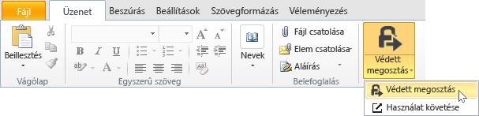

# A Rights Management megoszt&#243;alkalmaz&#225;s haszn&#225;lat&#225;val e-mail megosztott f&#225;jl v&#233;delme
Ha egy fájlt, amely megosztja által e-mailt, új verziója az eredeti fájlt hoz létre. Az eredeti fájl nem védett marad, és az új verzió védett, és automatikusan csatolva az e-mailt, majd küldeni.

Egyes esetekben (a Microsoft Word, az Excel és a PowerPoint által létrehozott fájlok) az RMS-megosztó alkalmazás hoz létre a fájlt, az e-mailt, csatlakozó két verziója. A fájl második verziója van egy **.ppdf** fájlnévkiterjesztést, és a PDF-árnyékmásolat-fájl. Ez a fájl verzióját biztosítja, hogy a címzett mindig lehet olvasni a fájlt, még akkor is, ha nem rendelkeznek a ugyanahhoz az alkalmazáshoz telepített létrehozásához használt. Ez gyakran a esetet Ha személyek, olvassa el az e-mailek, a mobil eszközök, és szeretné tekinteni a e-mail mellékletek. Megnyitni a fájlt, szükségük az RMS-megosztó alkalmazás. Ezt követően azokat a csatolt fájl olvasható, de azokat nem fogja tudni megváltoztatni, amíg a fájl más verzióját nyit meg, amely támogatja az RMS alkalmazás használatával.

Ha a szervezet Azure RMS használ, akkor is a nyomon követésére, hogy a megosztás által védett fájlok:

-   Válassza ki a lehetőséget, és az e-maileket kapni, ha valaki megpróbálja megnyitni ezeket a védett mellékleteket. Minden alkalommal, amikor a fájl megnyitásakor, értesítést kap, akik a fájlt, és ha, és hogy sikeres volt-e ezek a megnyitni próbált (azok voltak sikeresen hitelesített) vagy sem.

-   Használja a webhely követési dokumentációját. A fájl megosztása hozzáférési jogosultsága a dokumentum követési helyen visszavonása még leállítása. További tudnivalókért tekintse meg a [Nyomon követése, és a dokumentumok visszavonni, az RMS-megosztó alkalmazás használata esetén](../Topic/Track_and_revoke_your_documents_when_you_use_the_RMS_sharing_application.md).

## Az Outlook használatával: E-mail megosztott fájl védelme

1.  Az e-mail üzenetet létrehozni, és a fájlt csatolni. Ezután a a **üzenet** lapon, a a **RMS** csoportjában kattintson **védett megosztás** és kattintson a **védett megosztás** újra:

    

    Nem látja erre a gombra, ha valószínű, hogy az RMS-megosztó alkalmazás nincs telepítve a számítógépen, a legújabb verzióra nincs telepítve, vagy a telepítés befejezéséhez újra kell indítani a számítógépet. A megosztóalkalmazás telepítésével kapcsolatos további tudnivalókért tekintse meg a [Töltse le és telepítse a Rights Management megosztóalkalmazás](../Topic/Download_and_install_the_Rights_Management_sharing_application.md).

2.  Adja meg a beállításokat, ezt a fájlt a kívánt a [megosztani a védett párbeszédpanel](http://technet.microsoft.com/library/dn574738.aspx), és kattintson a **küldése most**.

### Más módon lehet védetté tenni a megosztott e-mail fájl
Védett fájl megosztása az Outlook használatával, másik módszert is meg is használhatnak:

-   A fájl Explorer: Ez a módszer használható az összes fájl.

-   Az Office alkalmazás: Ez a módszer használható az alkalmazások, amelyek az RMS-megosztó alkalmazás úgy, hogy az Office bővítmény használatával támogatja a **RMS** csoport a menüszalagon.

##### Fájl Intéző, vagy az Office alkalmazás használatával: E-mail megosztott fájl védelme

1.  Használja az alábbi lehetőségek közül:

    -   A fájl Explorer: Kattintson a jobb gombbal a fájlt, jelölje be **védelme az RMS**, majd válassza ki **védett megosztás**:

        

    -   Az Office alkalmazások, a Word, Excel és PowerPoint: Győződjön meg arról, hogy mentette a fájlt először. Ezután a a **kezdőlap** lapon, a a **RMS** csoportjában kattintson **védett megosztás** és kattintson a **védett megosztás** újra:

        

    Ha ezek a beállítások védelemre nem látja, valószínű, hogy az RMS-megosztó alkalmazás nincs telepítve a számítógépen, a legújabb verzióra nincs telepítve, vagy a telepítés befejezéséhez újra kell indítani a számítógépet. A megosztóalkalmazás telepítésével kapcsolatos további tudnivalókért tekintse meg a [Töltse le és telepítse a Rights Management megosztóalkalmazás](../Topic/Download_and_install_the_Rights_Management_sharing_application.md).

2.  Adja meg a beállításokat, ezt a fájlt a kívánt a [megosztani a védett párbeszédpanel](http://technet.microsoft.com/library/dn574738.aspx), és kattintson a **küldése**.

3.  Előfordulhat, hogy gyorsan párbeszédpanel jelenik meg, hogy a fájl védelmét, majd tekintse meg az e-mail üzenet létrehozott meg arról, hogy a címzett, hogy a mellékleteket a Microsoft RMS védett, és, hogy azok kell jelentkeznie a állapítható meg. Ha a hivatkozásra bejelentkezés, látják útmutatásért és hivatkozások, és győződjön meg arról, hogy tudják nyitni a védett melléklet.

    Példa:

    

    Vannak az alábbiak tűnődik meg: [Mi az automatikusan létrehozott .ppdf fájlhoz?](../Topic/Dialog_box_options_for_the_Rights_Management_sharing_application.md#BKMK_PPDF)

4.  Nem kötelező: Bármi, amelyet meg szeretne e-mailt is módosítható. Például adja hozzá, vagy módosítsa a tulajdonos vagy az üzenet szövegét.

    > [!WARNING]
    > Bár hozzáadása, vagy távolítsa el a személyek az e-mailt, ez nem módosítja a megadott melléklet engedélyeit a **védett megosztás** párbeszédpanel megnyitásához. Ha módosítani szeretné az engedélyeket, például személynek egy új engedélyek nyissa meg a fájlt, zárja be az e-mailt a mentése vagy elküldése nélkül, és visszatérés az 1. lépés.

5.  Az e-mailt küldeni.

## Példák és más utasítások
Előfordulhat, hogy hogyan használhatja a Rights Management megosztó alkalmazás- és útmutató utasításokat a, tekintse meg az alábbi szakaszok a Rights Management megosztási alkalmazás felhasználói útmutató:

-   [Példák az RMS-megosztó alkalmazás használatával](../Topic/Rights_Management_sharing_application_user_guide.md#BKMK_SharingExamples)

-   [Választható?](../Topic/Rights_Management_sharing_application_user_guide.md#BKMK_SharingInstructions)

## Lásd még
[A Rights Management megosztási alkalmazás felhasználói útmutató](../Topic/Rights_Management_sharing_application_user_guide.md)

