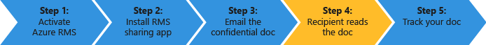

# R&#246;vid&#237;tett oktat&#243;program Azure Rights Management
Ez oktatóprogram gyorsan kipróbálására a Microsoft Azure Rights Management (más néven az Azure RMS) használata a szervezet, amely kell vennie kisebb, mint 15 percnyi csak 5 lépéseket. Fogja a szolgáltatás aktiválása, biztonságosan bizalmas dokumentum küldése e-mailek által valaki más szervezet és tudják, hogy a dokumentum megnyitása nyomon követésére. A bizalmas dokumentum küldve van, ha az átvitel titkosítva van, és csak akkor olvashatja csak az személy érkezik, a küldő által beállított engedélyek használatával.

Ez oktatóprogram célja a rendszergazdák és a tanácsadó, Súgó azokat egy információk védelme megoldás a szervezet Azure Rights Management értékelődik ki. Éles környezetben a rendszergazda által történik az utasításokat a szolgáltatás aktiválása, és a végfelhasználók által az utasításokat a dokumentum küldése történik. Mindkét utasításokat bemutatására a végpont forgatókönyv biztonságosan küldött bizalmas dokumentum valaki más szervezet, a oktatóprogram szerepelnek. Ha nehézségekbe ütközik a oktatóprogram befejezése, e-mail üzenet küldése [AskIPTeam](mailto:askipteam@microsoft.com?subject=Having%20problems%20with%20the%20Quick%20Start%20tutorial) és mi segít.

Ez a oktatóprogram befejezéséhez szüksége lesz a következők:

-   Egy előfizetést, amely támogatja az Azure Rights Management. Ez lehet a előfizetéses vagy próba-előfizetéssel. Ha módosítani szeretné használni a dokumentum nyomon követése, amely kötelező 5. lépés a oktatóprogram, az előfizetés támogatnia kell a dokumentum nyomon követése. Az előfizetési beállítások és a szabad kísérletek mutató hivatkozások kapcsolatos további tudnivalókért tekintse meg a [Felhő előfizetések, amelyek támogatják az Azure RMS](../Topic/Requirements_for_Azure_Rights_Management.md#BKMK_SupportedSubscriptions) szakasz a [Az Azure Rights Management követelményei](../Topic/Requirements_for_Azure_Rights_Management.md) című témakört.

    Tipp: Szerezze be az előfizetés van szüksége, ha erre előre, mert egyes esetekben vehet igénybe.

-   Jelentkezzen be az Office 365 felügyeleti központban vagy az Azure portál, így a Rights Management szolgáltatás aktiválhatja a rendszergazdai fiók. Ez a fiók is rendelkeznie kell egy e-mail címet és egy működő e-mail szolgáltatás (például az Exchange Online vagy az Exchange Server).

-   Windows (Windows 7 SP1 legalább), és amely telepítette az Office 2016, az Office 2013 vagy az Office 2010 rendszert futtató számítógép.

Lássuk a kezdeti lépéseket.

## 1. lépés: A Rights Management szolgáltatás aktiválása

Annak ellenére, hogy a előfordulhat, hogy egy előfizetést, amely támogatja az Azure Rights Management, a szolgáltatás alapértelmezés szerint le van tiltva. Az aktiválás is használhatja, vagy az Office 365 felügyeleti központban, vagy az Azure portál:

-   Ha az Office 365-előfizetéssel, amely tartalmazza az Azure Rights Management, vagy az Office 365 előfizetéssel rendelkezik, amely kizárja az Azure Rights Management, de az Azure RMS önálló előfizetés: **Használja az Office 365 felügyeleti központban**.

-   Ha nem rendelkezik az Office 365-előfizetés: **Használja az Azure portál**.

#### Az Office 365 felügyeleti központban a Rights Management aktiválása

1.  Nyissa meg a [Office 365 portálon](https://portal.office.com/) és a bejelentkezés a munka vagy iskola fiókjával.

2.  Ha az Office 365 felügyeleti központban nem jeleníti meg automatikusan, jelölje ki az alkalmazás indító ikon bal felső, és válassza a **rendszergazdai**. A **rendszergazdai** mozaik jelenik meg, csak az Office 365-rendszergazdák számára.

    > [!TIP]
    > Felügyeleti központ segítségért tekintse meg a [kapcsolatos az Office 365 felügyeleti központban - rendszergazdai súgó](https://support.office.com/article/About-the-Office-365-admin-center-Admin-Help-58537702-d421-4d02-8141-e128e3703547).

3.  A bal oldali ablaktáblában bontsa ki a **SZOLGÁLTATÁSBEÁLLÍTÁSOK**.

4.  Kattintson a **Rights Management**.

5.  Az a **a RIGHTS MANAGEMENT** lapra, kattintson a **kezelése**.

6.  Az a **rights management** lapra, kattintson a **aktiválása**.

7.  Amikor a rendszer **szeretné aktiválni a Rights Management?**, kattintson a **aktiválása**.

Most végrehajtásakor **Rights management aktiválva van** és a lehetőség inaktiválása (szükség lehet az oldal manuális frissítéséhez)

Ebben az időszakban, ne jelölje be a **Speciális funkciók**. Ez jut az Azure portál amennyiben úgy is konfigurálhatja a sablonok, amelyek nem szükségesek a oktatóprogram a. Ehelyett bezárhatja az Office 365 felügyeleti központban.

#### A Rights Management aktiválása a Azure portálról

1.  Nyissa meg a [Azure portál](http://go.microsoft.com/fwlink/p/?LinkID=275081) és a bejelentkezés.

2.  A bal oldali ablaktáblában kattintson a **az ACTIVE DIRECTORY**.

3.  Az a **az active directory** lapra, kattintson a **a RIGHTS MANAGEMENT**.

4.  Jelölje ki a könyvtárat, kezelheti a [!INCLUDE[aad_rightsmanagement_2](../Token/aad_rightsmanagement_2_md.md)], kattintson a **Aktiválás**, majd erősítse meg a műveletet.

A **RIGHTS MANAGEMENT állapot** most megjelenjen-e **aktív** és a **Aktiválás** beállítást a rendszer kicseréli a **INAKTIVÁLÁS**.

Bár a portál is konfigurálhatja a Rights Management egyéb beállítások, ezek nem szükségesek a ez oktatóprogram, így az Azure portál bezárhatja.

Ez minden, az első lépés szükséges. A szolgáltatás aktiválva van, így a szervezet összes felhasználó most elindíthatja a fontos és időérzékeny dokumentumok védelme érdekében. Éles üzemi környezetben korlátozhatja, akik ehhez első lépésként egy szakaszolt alkalmazásokon lehet szükség. De nem szükséges a oktatóprogram.

Bár a nem szereplő itt, az éles üzemi környezetben valószínűleg is valószínűleg kívánt egyéni sablonok konfigurálása. Sablonok megkönnyíti a felhasználók számára, hogy gyorsan alkalmazása a jobb oldali beállításait, ha szükségük van a fájlok védelme érdekében. Ha aktiválni a Rights Management, 2 alapértelmezett sablonok automatikusan kap, és valószínűleg kívánt kiegészítik az ezen a saját egyéni sablonok éles környezetben. Azonban a sablonok nem szükséges a oktatóprogram, így készen áll a következő lépéssel.

|Ha azt szeretné, hogy a további információk|További információk|
|-----------------------------------------------|-----------------------|
|A Rights Management aktiválása, és annak beállítását, akik védhető a fájlok és az e-mailt, ha a szolgáltatás aktiválva →|[Az Azure Rights Management aktiválása](../Topic/Activating_Azure_Rights_Management.md)|
|Az alapértelmezett sablonokat és létrehozása új, egyéni sablonok →|[Az Azure Rights Management egyéni sablonok konfigurálása](../Topic/Configuring_Custom_Templates_for_Azure_Rights_Management.md)|

## 2. lépés: A Rights Management megosztóalkalmazás telepítése

A Rights Management megosztóalkalmazás (más néven a "RMS-megosztó alkalmazás") nem Azure Rights Management követelmény, de az összes számítógép és a mobil eszközök, amely támogatja az Azure Rights Management javasoljuk. Az RMS-megosztó alkalmazás integrálódik, az Office alkalmazások telepítésével az Office-bővítmény, hogy a felhasználók könnyen védhető fájlok közvetlenül a menüszalagon látható. Azt is lehetővé teszi az összes fájltípusok védelme fájlt, amelyet nem támogatottak natív módon Azure Rights Management, és a dokumentum nyomon követése a webhely felhasználói nyomon követésére és azok védelme fájlok visszavonni az általános védelmi alkalmazásával. A hely követési később ez oktatóprogram a dokumentum fogjuk használni.

Az alkalmazás letöltéséhez ingyenes, és kínál egy éles környezetben a telepítése. De ez a oktatóprogram a mi lesz helyi szinten telepítse.

#### Töltse le és telepítse a Rights Management megosztóalkalmazás

1.  Nyissa meg a [Microsoft Rights Management](http://go.microsoft.com/fwlink/?LinkId=303970) oldalon, a Microsoft webhelyén.

2.  Az a **számítógépek** területen kattintson a ikonja a **RMS alkalmazás Windows rendszerhez** és mentse a **Setup.exe** fájlt a Microsoft Rights Management megosztóalkalmazás telepítése.

3.  Helyi telepítés egy rendszergazdai fiók, futtassa a Setup.exe fájlt, amely töltött le kell használnia. Ha továbbra is kéri, kattintson a **Igen**.

4.  Az a **a telepítő a Microsoft RMS** lapra, kattintson a **Tovább**, és várjon, amíg a telepítés befejezéséhez.

5.  A telepítés befejezésekor kattintson **újraindítása** Ha a rendszer kéri, indítsa újra a számítógépet, vagy kattintson a  **Bezárás** a telepítés befejezéséhez.

Most készen áll, amelyet meg szeretne osztani másokkal, de csak a megadott felhasználókkal információkat tartalmazó fájlokat védelmének megkezdéséhez.

|Ha azt szeretné, hogy a további információk|További információk|
|-----------------------------------------------|-----------------------|
|A Rights Management megosztóalkalmazás a Windows és a felhasználó utasításokat → egy helyi telepítési információk|[A Rights Management megosztási alkalmazás felhasználói útmutató](http://technet.microsoft.com/library/dn339006.aspx)|
|A Rights Management megosztóalkalmazás a Windows rendszerhez és a további technikai információk → a parancsfájlalapú telepítéséről|[A Rights Management megosztási alkalmazás rendszergazda guide](http://technet.microsoft.com/library/dn339003.aspx)|
|A natív protection, és az általános védelmi → különbséget|[Mi az általános védelmi és beépített (natív) protection közötti különbség?](https://technet.microsoft.com/library/dn574738.aspx)|

## 3. lépés: A dokumentum lehet védetté tenni kívánt e-mail

Ez a lépés első létrehozása és használata, amely a dokumentum kívánt védelme határoz meg, és nevezze el, a Word dokumentum mentése **Confidential.docx**. Ez a oktatóprogram nem számít, hogy milyen szöveg ténylegesen tartalmaz, de érdemes azt a szöveget tartalmazza, így Ön egyszerűbben ellenőrizze, hogy, hogy a meghatalmazott címzett sikerült olvasni. Előfordulhat, hogy például a típusa: **Ha el az e-mail mellékletek tudja olvasni, a küldő sikeresen osztott védett fájl Azure RMS.**

Ezután készen áll a dokumentum biztonságosan osztani az e-mail.

#### A dokumentum biztonságosan osztani az e-mail

1.  Outlook használja, hozzon létre egy új, és az újonnan létrehozott fájlt csatolni.

2.  Az a **a** mezőbe írjon be egy vagy több üzleti e-mail címek. Győződjön meg arról, például adja meg munkahelyi e-mail cím, **janetm@contoso.com** vagy **p.dover@fabrikam.com** mert jelenleg Azure Rights Management nem támogatja a személyes e-mail címek, előfordulhat, hogy az Internet szolgáltatótól otthon használja. Ne aggódjon a címzett azt is van-e Azure Rights Management vagy sem.

3.  Írja be például a tárgyat,  **Bizalmas dokumentum** és írja be például az e-mailek egy rövid üzenet **olvassa el a a bizalmas dokumentum, és nem másokkal.**

4.  Ezután a a **üzenet** lapon, a a **RMS** csoportjában kattintson **védett megosztás** és kattintson a **védett megosztás** újra:

5.  Az a **védett megosztás** párbeszédpanel:

    1.  Válasszon **Viewer – csak a nézet**.

        Ez azt jelenti, hogy a dokumentum megtekintéséhez, de nem szerkesztése, vagy kinyomtathatja a címzettek tudják.

    2.  Válasszon **e-mailt kérek, ha valaki megpróbálja megnyitni ezeket a dokumentumokat**.

        Jelenik meg az értesítő e-mailek minden alkalommal, amikor a címzett próbálja megnyitni a melléklet, és is, ha valaki megpróbálja megnyitni – például a címzett továbbítja az e-mailt együttes dolgozó. Ez az utolsó esetben látni fogja a, hogy a rendszer megtagadta a hozzáférést, és a felhasználó adatait is meghatározható küldése, hogy a személy, amely tudják nyitni a dokumentum egy példányát.

    3.  Válasszon **szeretnék azonnal visszavonni az ezeket a dokumentumokat a hozzáférést**.

        Ez a beállítás megköveteli a címzett, hogy az internetkapcsolatot a melléklet minden megnyitásakor, de előnyökkel, hogy később a a dokumentum visszavonni, ha a következő alkalommal azok próbálja megnyitni, azokat nem fogja tudni elvégezni. Ha nem jelöli be ezt a lehetőséget, a címzett lehet az internetkapcsolat nélkül is, de az, hogy ha később a a dokumentum visszavonni, lehet, ha, amely lép érvénybe a késés hátrányos megnyitható.

    4.  Kattintson a **küldése**.

        Az e-mailt a melléklettel küld a megadott e-mail címek. Az e-mail üzenet kívül látja utasításokat a csatolt dokumentum Azure Rights Management által védett olvasása.

A védett dokumentum elküldött, most készen áll címzettekkel várja meg annak a érkeznek, és nyissa meg a kérdés. De az Outlook, ne zárja be, mert a fogjuk használni azt újra a végső lépésben a melléklet nyomon követésére.

|Ha azt szeretné, hogy a további információk|További információk|
|-----------------------------------------------|-----------------------|
|Részletes útmutatást és más módon történő e-mail → megosztott fájl védett|[A Rights Management megosztóalkalmazás használatával e-mail megosztott fájl védelme](https://technet.microsoft.com/library/dn574735.aspx)|
|A lehetőségek a kapcsolatban a **védett megosztás** párbeszédpanel →|[A Rights Management megosztóalkalmazás párbeszédpanel beállításai](https://technet.microsoft.com/library/dn574738.aspx)|

## 4. lépés: Kérje meg a címzett a mailezett dokumentum megnyitása

A címzettek sok eszköz segítségével olvassa el a védett dokumentumot e-mail mellékletként küldött. Az eszközök között iPads, a iPhones, a Android táblagépek és a telefonok, a Mac-számítógépek, valamint Windows rendszerű számítógép.

Kérje meg az elküldött e-mailt olvasni őket. Az e-mailt látja és előtt, amely a következő szöveg:

**A küldő a mellékleteket, a Microsoft RMS rendelkezik védett. Kell** [Bejelentkezés](http://aka.ms/rms) **megnyitásához őket.**

A hivatkozásra, ha tart azokat az RMS-megosztó alkalmazás telepítése, és ha szükséges, a bejelentkezés utasításokat a egy ingyenes fiókot. A szabad fiók biztosít azokat egy előfizetést az RMS szolgáltatást egyének, amely biztosítja, hogy engedéllyel rendelkező felhasználók bármikor olvashatja egy védett dokumentum, még akkor is, ha a szervezet nem rendelkezik az Azure RMS. Ezután készen állnak a védett melléklet olvasható az alábbi utasításokat.

#### A védett dokumentum melléklet megtekintése

1.  Azure Rights Management védett, a Word dokumentumba, mert nincsenek az e-mailt két mellékleteket. Ezek a ugyanazt a fájlt, de különböző kiterjesztésű ténylegesen két verziója. Nyissa meg a verzióját, amelynek a **.ppdf** fájlnévkiterjesztés (**Confidential.ppdf**).

    Ha egy verziója van [Office az eszközön, amely támogatja a Rights Management](https://technet.microsoft.com/library/dn655136.aspx), úgy is megnyithatja, az fájl verziója (**Confidential.docx**), így a Word jelenik meg.

2.  Kéri a felhasználónevet és jelszót, ha az e-mail cím, küldjön e-mailek és a melléklet használt ugyanabban a formában adja meg a felhasználónevet. Például **janetm@contoso.com** vagy **p.dover@fabrikam.com**. A jelszót írja be az RMS használatához való regisztráció egyének megadott jelszót. Vagy ha a szervezet Azure RMS, adja meg a szokásos munka jelszavát.

A dokumentum nyílik meg, és most olvassa el a tartalmát. Például, hogy előfordulhat, hogy **el az e-mail mellékletek tudja olvasni, ha a küldő sikeresen osztott védett fájl Azure RMS egyidejű használatát** Mivel az csak olvasható, a tartalom nem módosítható.

Nem kötelező lépésként sikerült kérje meg a címzett, az e-mailek továbbítására, amely nem tartozik az eredeti e-mailben mások számára. Akkor is, ha ezek mások számára a szervezet Azure Rights Management működik, vagy a saját RMS egyének előfizetés vonatkoznak, azokat nem fogja tudni megnyitni a mellékletet. Ezeket a rendszer támogatni a felhasználónév, amikor a rendszer megtagadja a dokumentum a hozzáférést.

Most, hogy a címzett megnyitotta a mellékletet, és szükség esetén továbbított azt valaki másnak, várt lekérni a jelentéseket a tevékenység e-mailben értesítést. De e-mailek könnyen elveszíti az idő múlásával, így jobban nyomon követésének módját, akik érhető el a dokumentum használni a webhely, amelyre az utolsó lépésben követési dokumentumot.

|Ha azt szeretné, hogy a további információk|További információk|
|-----------------------------------------------|-----------------------|
|Teljes utasítások Azure Rights Management → által védett fájlok megtekintése|[Megtekintése és használata a Rights Management védett fájlok](https://technet.microsoft.com/library/dn574741.aspx)|
|A szabad előfizetésével, a személyek → az RMS|[RMS egyének és az Azure Rights Management](../Topic/RMS_for_Individuals_and_Azure_Rights_Management.md)|
|A két verzió, a fájl kapcsolatban, hogy látható csatolva az e-mail üzenet →|[Mi az automatikusan létrehozott .ppdf fájlhoz?](https://technet.microsoft.com/library/dn574738.aspx)|

## 5. lépés: A védett dokumentum nyomon követése

> [!NOTE]
> Ez a lépés rendelkeznie kell egy előfizetést, amely támogatja a dokumentum nyomon követése. Ellenőrizze, hogy az előfizetés tartalmazza-e a dokumentum nyomon követése, lásd a [Rights Management szolgáltatások (RMS) összehasonlítás ajánlatok](https://technet.microsoft.com/dn858608.aspx).

Ez a lépés nem kötelező, de a legtöbb személyek, például ismernie kell a melléklet személyeknek jelentkezéseket lett megnyitva, akkor, ha, és még honnan. Példa:

-   Várt választ valaki által megadott idő, és megtekintheti a dokumentum követési webhelyről, hogy ő még nem nyitható meg a dokumentum annak ellenére, hogy a határidő közeledik. A nyomon követési e-mail küldése rendszerbe, vagy a telefon rendszerbe, ne feledje időben.

-   Biztosításáért, hogy valaki megnyitotta a dokumentumot, a nyomon követés után kérje a saját if ő kérdése van, vagy további információk igényel.

#### A védett dokumentum nyomon követésére

1.  Használja az Outlook, a **kezdőlap** lapon, a a **RMS** csoportjában kattintson **nyomon követése használati**.

2.  Ha azt látja, hogy a **védelme és a megosztás a saját feltételei szerint** lapra, kattintson a **Bejelentkezés** és a felhasználónevet és jelszót adja meg újra.

3.  Az a **a megosztott dokumentumok** oldalon, látni fogja a dokumentum, amely az e-mailt, csatolt **Confidential.docx**. Ezen a ponton fájl csak jelenik meg, de a lista növekszik, a további védett dokumentumok megosztásához.

    Ezen az oldalon látni fogja, ha a dokumentum (elküldésekor meg az e-mailt a védett melléklettel), a dátumot, az utolsó tevékenység és a címzett, az e-mailben küldött neve megosztott. További részleteket a dokumentum neve gombra.

4.  Az új lap, amelyen rákattintott a fájl nevét, a látni fogja, hogy a dokumentum csak az összefoglaló információk, és más beállítások listáját, amelyek a dokumentum (**lista**, **Ütemterv**, **térkép**, **Beállítások**).

    Nyomon követheti a védett dokumentum különböző módjai minden lehetőséget választva. Vagy továbbra is az a **Összefoglalás** lapján kattintson **Megnyitás az Excel programban** exportálja az adatokat egy számolótáblába, vagy kattintson **hozzáférés visszavonása** a dokumentum megosztását.

Térjen vissza erre a webhelyre, a védett dokumentumhoz tevékenység további követéséhez, vagy ha szükséges, visszavonni a hozzáférést. Akkor is hozzáférhet a hely a mobileszköz vagy tábla, a böngésző segítségével, ez a hivatkozás: [dokumentumkövetési](http://go.microsoft.com/fwlink/?LinkId=529562)

|Ha azt szeretné, hogy a további információk|További információk|
|-----------------------------------------------|-----------------------|
|Részletes utasítások a dokumentumok → nyomon követésére|[Nyomon követése, és a dokumentumok visszavonni, az RMS-megosztó alkalmazás használata esetén](https://technet.microsoft.com/library/dn986611.aspx)|
|Videó két perc, amely ismerteti, valamint a dokumentumkövetési → jeleníti meg|[Az Azure RMS dokumentumok nyomon követése és visszavonása](http://channel9.msdn.com/Series/Information-Protection/Azure-RMS-Document-Tracking-and-Revocation)|
|A hibaelhárítás és a felhasználói kérdések →|[Gyakran ismételt kérdések a dokumentumok nyomon követése](https://technet.microsoft.com/dn947488)|

## Az alábbi lépéseket
Ez az oktatóanyag lépcsőzetes keresztül egyetlen eset hogyan Azure RMS segítségével az adatok védelme. Egyéb gyakori alkalmazások megtekintéséhez nyissa meg a [Azure RMS művelettel](https://technet.microsoft.com/library/jj585026.aspx) szakasz a [Mi az Azure Rights Management?](../Topic/What_is_Azure_Rights_Management_.md) cikk. Nincsenek más szakaszok is találhat hasznos cikkben, például az Azure RMS működése, és milyen üzleti problémák megoldásához is.

Ha Ön megkezdheti az Azure RMS használata telepítése a [Azure Rights Management – üzembehelyezési menetrend](../Topic/Azure_Rights_Management_Deployment_Roadmap.md) a központi telepítés lépéseit, és a hivatkozások útmutató utasításokat.

## Lásd még
[Getting Started with Azure Rights Management](../Topic/Getting_Started_with_Azure_Rights_Management.md)

