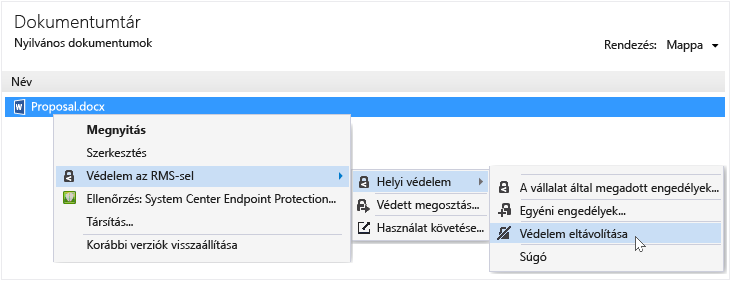

# A Rights Management megoszt&#243;alkalmaz&#225;s haszn&#225;lat&#225;val egy f&#225;jl v&#233;delm&#233;nek megsz&#252;ntet&#233;se
Fájl védelmének eltávolításához (Ez azt jelenti, hogy a fájl védelem), amely az RMS-megosztó alkalmazás segítségével korábban már védett, használnia a **távolítsa el a védelmi** fájl Explorer lehetőséget.

> [!IMPORTANT]
> A fájl a védelem megszüntetéséhez tulajdonos kell lennie.

### A védelem megszüntetéséhez-fájlból

1.  A fájl Explorer, kattintson a jobb gombbal a fájl (például Sample.ptxt), jelölje be **védelme az RMS**, kattintson a **védelem**, és kattintson a **távolítsa el a védelmi**:

    

    Előfordulhat, hogy bekéri az Ön hitelesítő adatokat.

Az eredeti védett fájlt (például Sample.ptxt) törlődik, és olyan fájl, amelynek ugyanaz a neve, de a védelem nélküli fájlnévkiterjesztést (például példa.txt) helyettesíti.

## Példák és más utasítások
Előfordulhat, hogy hogyan használhatja a Rights Management megosztó alkalmazás- és útmutató utasításokat a, tekintse meg az alábbi szakaszok a Rights Management megosztási alkalmazás felhasználói útmutató:

-   [Példák az RMS-megosztó alkalmazás használatával](../Topic/Rights_Management_sharing_application_user_guide.md#BKMK_SharingExamples)

-   [Választható?](../Topic/Rights_Management_sharing_application_user_guide.md#BKMK_SharingInstructions)

## Lásd még
[A Rights Management megosztási alkalmazás felhasználói útmutató](../Topic/Rights_Management_sharing_application_user_guide.md)

