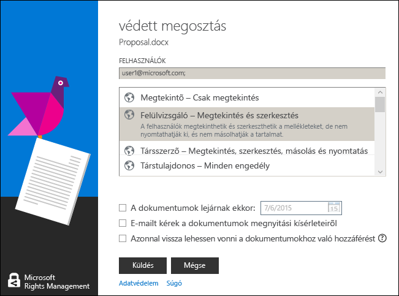

# 3., &#225;tdolgozott v&#225;ltozat: A Microsoft Rights Management megoszt&#243;alkalmaz&#225;s &#250;tmutat&#243;ja
Ez az útmutató a Windowshoz készült Microsoft Rights Management (RMS) megosztóalkalmazás használatához nyújt segítséget, amellyel megakadályozhatja fontos dokumentumainak és képeinek jogosulatlan megtekintését, még akkor is, ha elküldi őket e-mailben, vagy egy másik eszközre menti. Az alkalmazás azt is lehetővé teszi, hogy megnyissa és használja azokat a fájlokat, amelyeket mások ugyanezzel a tartalomvédelmi technológiával tettek védetté.

A megosztó alkalmazás a következőképpen biztosítja fájljai védelmét:

-   Olyan funkciókkal bővíti a Fájlkezelőt (más néven Windows Intézőt a Windows 7 és korábbi verziókban), amelyek a mappákban lévő fájlok kezelésekor megkönnyítik egy adott fájl, egyszerre több fájl, vagy egy mappa összes fájljának védelmét.

-   Minden fájltípushoz védelmet biztosít, és beépített megjelenítővel rendelkezik a gyakran használt szöveg- és képfájlokhoz.

-   A Word, a PowerPoint és az Excel Microsoft Office eszköztárán elérhetővé teszi a **Védett megosztás** gombot.

Az RMS megosztóalkalmazás telepítéséhez mindössze egy Windows 7 vagy Windows 8 rendszert futtató számítógépre és egy helyi rendszergazdai fiókra van szüksége. Ezt követően töltse le a Microsoft webhelyéről ezt az ingyenes alkalmazást, és telepítse.

Ha kérdéseire nem talált választ ebben az útmutatóban, tekintse meg [A Microsoft Rights Management megosztóalkalmazás Windows-változatával kapcsolatos gyakori kérdések](http://go.microsoft.com/fwlink/?LinkId=303971) című témakört.

## Példák az RMS megosztóalkalmazás használatára
Íme néhány példa arra, hogy miként védheti meg fájljait az RMS megosztóalkalmazás használatával.

|Forgatókönyv|RMS megosztóalkalmazást használó megoldás|
|----------------|---------------------------------------------|
|**Egy bizalmas vállalati dokumentumot szeretnék biztonságosan egy másik eszközre másolni**<br /><br />A számítógépén egy stratégiai dokumentumon dolgozik, amely bizalmas vállalati dokumentum, és szeretné egy USB-meghajtóra másolni, hogy tovább dolgozhasson rajta, miután elhagyta az irodát és már nem fér hozzá a vállalati hálózathoz.|Az RMS megosztóalkalmazás telepítve van mind a számítógépén, mind a laptopján. A számítógépen lévő Fájlkezelőben egy sablon használatával védetté teszi a fájlt, hogy a vállalaton kívüli személyek ne férhessenek hozzá. A fájlt a hordozható meghajtóra másolja, csatlakoztatja a meghajtót a laptopjához, és folytatja a munkát a dokumentumon. Ha elveszti a hordozható meghajtót, vagy ellopják a laptopját, a vállalatán kívüli személyek nem férhetnek hozzá a dokumentumhoz.|
|**Pénzügyi adatokat szeretnék biztonságosan megosztani valakivel, akiben megbízom, és nem a vállalatom alkalmazottja.**<br /><br />Egy partnervállalattal működik együtt, és e-mailben szeretne elküldeni nekik egy Excel-táblázatot, amely a tervezett értékesítések számait tartalmazza. Azt szeretné, hogy a számokat megtekinthessék, de megváltoztatni ne tudják.|Az Excel menüszalagján kattintson a **Védett megosztás** gombra, írja be annak a két személynek a nevét, akivel együttműködik a partnervállalatnál, válassza a **Megtekintő** lehetőséget a csúszkán, és kattintson a **Küldés** gombra.<br /><br />Amikor az e-mail megérkezik a partnervállalathoz, csak az e-mail címzettjei tekinthetik meg a táblázatot, de menteni, módosítani, kinyomtatni és továbbítani nem tudják.|
|**Biztonságosan el kell küldenem e-mailben egy mérnöki diagramot valakinek, aki iOS-eszközt használ.**<br /><br />A vállalata egyéni mérnöki alkalmazást használ, és szeretne elküldeni egy szigorúan bizalmas diagramot a munkatársának, akiről tudja, hogy rendszeresen ellenőrzi az e-maileket iOS-eszközén.|A Fájlkezelőben kattintson a jobb gombbal a fájlra, majd válassza a **Védett megosztás** parancsot. Az RMS megosztóalkalmazás automatikusan felismeri, ha a fájlkiterjesztés az RMS-t natívan nem támogató alkalmazáshoz tartozik, és amikor a fájlt egy e-mailhez csatolja, akkor automatikusan általános védelemmel ellátott fájllá konvertálja, és szintén automatikusan kiválasztja a **Felhasználás engedélyezése minden eszközön** beállítást.<br /><br />A címzett megkapja az e-mailt az iOS-eszközén, az e-mailben lévő hivatkozásra kattintva letölti az RMS megosztóalkalmazást, telepíti az iOS-eszközökhöz készült verziót, majd megtekinti a diagramot.|
|**A vállalatom nem használja a Rights Management szolgáltatást, de kaptam egy RMS-védelemmel ellátott mellékletet tartalmazó e-mailt**<br /><br />Az e-mail küldőjében megbízik, mert régebben együtt dolgoztak, és azt gyanítja, hogy valószínűleg egy kecsegtető új üzleti lehetőségre vonatkozó információt küldött Önnek.|Az RMS megosztóalkalmazás számítógépre történő letöltését ismertető hivatkozásra kattint az e-mailben, telepíti az alkalmazást, majd feliratkozik az egyéni felhasználók számára készült RMS szolgáltatásra. A Microsoft tudatja majd, hogy a vállalatának nincs előfizetése az Office 365 alkalmazáscsomagra, küld egy e-mailt, hogy hajtsa végre az ingyenes feliratkozást. Ezután lépjen be az új fiókjába. Ekkor megnyithatja az e-mail mellékletét, és elolvashatja az új üzleti lehetőséggel kapcsolatos információkat.|

## <a name="BKMK_Install"></a>Az RMS megosztóalkalmazás letöltése és telepítése
> [!IMPORTANT]
> Az RMS megosztóalkalmazás telepítéséhez helyi rendszergazdai fiókkal kell rendelkeznie. Ha nem helyi rendszergazdaként jelentkezik be, akkor a 3. lépésben, a Setup.exe futtatásához használja a **Futtatás rendszergazdaként** lehetőséget.

Az RMS megosztóalkalmazás telepítéséhez kövesse az alábbi lépéseket:

1.  A Microsoft webhelyén navigáljon a [Microsoft Rights Management](http://go.microsoft.com/fwlink/?LinkId=303970) oldalra.

2.  A **Számítógépek** szakaszban kattintson az **RMS alkalmazás Windows rendszerre** lehetőségre, és mentse el a Microsoft Rights Management megosztóalkalmazás telepítőcsomagját a számítógépére.

3.  Kattintson duplán a letöltött tömörített fájlra, majd ismét kattintson duplán a **setup.exe** fájlra. Ha választania kell, hogy folytatja-e a telepítést, kattintson az **Igen** lehetőségre.

4.  **A Microsoft RMS telepítése** lapon kattintson a **Tovább** gombra, majd várja meg, amíg a telepítés befejeződik.

5.  Miután a telepítő végzett, kattintson az **Újraindítás** lehetőségre, hogy a számítógép újraindításával befejezze a telepítést. Vagy kattintson a **Bezárás** lehetőségre, és később a számítógép újraindításával fejezze be a telepítést.

Most már készen áll, hogy védetté tegye fájljait, vagy elolvassa a mások által védelem alá helyezett fájlokat.

## <a name="BKMK_UsingMSRMSApp"></a>Mit kíván tenni?
Az alábbi útmutatók segítséget nyújtanak a védett fájlokkal történő munkavégzéshez.

### <a name="BKMK_CreatePTXT"></a>Védett szövegfájl létrehozása
Egy szabályos szövegfájlt (.txt) átalakíthat .ptxt kiterjesztésű védett fájllá.

##### Védett szövegfájl (.ptxt) létrehozása

1.  A Fájlkezelőben kattintson a jobb gombbal egy mappában, ezután kattintson az **Új**, majd a **Szöveges dokumentum** elemekre.

2.  Nevezze át a fájlt (például Minta.txt-re).

3.  Kattintson duplán a fájlra, és nyissa meg a Jegyzettömbben.

4.  A Jegyzettömbben írjon be néhány sor szöveget a fájlba, majd mentse a fájlt. Példaszövegként használhatja a következőt.

    ```
    This is a sample text file.
    This is a sample text file.
    This is a sample text file.
    This is a sample text file. 
    This is a sample text file.
    This is a sample text file.
    ```

5.  Kattintson a jobb gombbal a fájlra, majd a **Helyi védelem** lehetőségre, és válasszon ki egy sablont a listából. Ha első alkalommal véd meg egy fájlt ezen a számítógépen, akkor a vállalata által megadott sablonok letöltéséhez először ki kell választania a **A vállalat által megadott engedélyek** lehetőséget.

6.  A **Microsoft Rights Management megosztóalkalmazás** képernyőn erősítse meg az alkalmazni kívánt házirendet, kattintson az **Alkalmaz** gombra, majd miután a fájl védetté vált, a **Bezárás** gombra.

### <a name="BKMK_ViewPTXT"></a>Védett szövegfájl (.ptxt) vagy védett képfájl megtekintése
Egy védett szövegfájl (.ptxt) megtekintéséhez a Fájlkezelőben kattintson duplán a fájlra (például a Minta.txt-re). Előfordulhat, hogy az alkalmazás kéri a hitelesítő adatok megadását. Amikor megnyílik a fájl, felül megjelenik a fájl védelmi házirendje.

A védett képeket ugyanígy tekintheti és nyithatja meg.

### <a name="BKMK_CreatePFILE"></a>Általános védelemmel ellátott fájl létrehozása
Az általános védelmi (.pfile) formátumot olyan fájltípusok általános szintű védelmére használja, amelyek az RMS megosztóalkalmazásban vagy más beépített RMS-típusú védelmet biztosító alkalmazásban közvetlenül nem támogatottak. A Microsoft webhely [Microsoft Rights Management](http://go.microsoft.com/fwlink/?LinkId=303970) oldalán gyorsan ellenőrizheti, hogy mely alkalmazások támogatják a beépített RMS-védelmet.

Például a Microsoft Visio például jelenleg nem támogatja beépített módon az RMS-védelmet, ezért a Microsoft Visio alkalmazással létrehozott .vsd fájlokhoz általános védelmet célszerű használni.

> [!TIP]
> Mi a különbség a beépített (natív) védelem és az általános védelem között?
> 
> -   A általános védelemmel rendelkező fájlt a jogosulatlan személyek nem tudják megnyitni. Azonban az arra jogosult személyek a fájl megnyitása után védelem nélkül továbbíthatják azt másoknak, vagy elmenthetik egy mások által hozzáférhető helyre. A fájl felső részén azonban megjelenik egy üzenet, amely közli velük, hogy milyen engedélyeik vannak a fájllal kapcsolatban, és kéri ezek betartását, de ez a védelem nem kényszeríthető. Ezenfelül amikor általános védelemmel lát el egy fájlt, akkor a hitelesítésnél szigorúbban nem korlátozhatja az engedélyeket. Például ha egyéni engedélyeket használ, az RMS megosztóalkalmazás csúszkája automatikusan beáll a **TÁRSTULAJDONOS** beállításra, és ezt nem módosíthatja olyan több korlátozást tartalmazó engedélyekre, mint például a **MEGTEKINTŐ** vagy a **TÁRSSZERZŐ**.
> -   Ha viszont olyan alkalmazásokkal használja a beépített RMS-védelmet, amelyek támogatják azt (például Office-fájlokkal), a fájl védelme akkor is megmarad, ha elküldi egy másik személynek, vagy egy másik helyre menti. Ráadásul az ilyen fájlok védelem alá helyezésekor korlátozó engedélyeket is használhat, hogy a fájl például csak olvasható legyen, vagy szerkeszthető legyen, de ne lehessen kinyomtatni vagy másolni. Például ha egyéni engedélyeket használ, az RMS megosztóalkalmazás csúszkája automatikusan beáll a **FELÜLVIZSGÁLÓ** beállításra, amelyet ezután átállíthat egy tetszőleges szigorúságú korlátozásra.

##### Példa: Általános védelemmel ellátott fájl (.pfile) létrehozása Visio rajzfájlból (.vsd)

1.  A Fájlkezelőben kattintson a jobb gombbal egy mappában, ezután kattintson az **Új**, majd az **Új Visio dokumentum** elemekre.

2.  Nevezze át a fájlt (például Minta.vsd-re).

3.  A fájlra duplán kattintva nyissa meg a Visióban.

4.  A Visióban adjon elemeket a rajzhoz, majd mentse és zárja be a fájlt.

5.  Kattintson a jobb gombbal a fájlra, majd a **Helyi védelem** lehetőségre, és válasszon ki egy házirendsablont a listából. Ha első alkalommal véd meg egy fájlt ezen a számítógépen, akkor a vállalata által megadott sablonok letöltéséhez először ki kell választania a **A vállalat által megadott engedélyek** lehetőséget.

6.  A **Microsoft Rights Management megosztóalkalmazás** képernyőn erősítse meg az alkalmazni kívánt házirendet, majd kattintson az **Alkalmaz** gombra.

7.  Egy üzenet jelzi, hogy a védett fájl .pfile fájlként lett mentve (például: Minta.vsd.pfile). Az eredeti fájl törlődik.

### <a name="BKMK_ViewPFILE"></a>Általános védelemmel ellátott fájl (.pfile) megtekintése
Egy általános védelemmel ellátott fájl (.pfile) esetében a Fájlkezelőben kattintson duplán az általános védelemmel ellátott (.pfile) fájlra (például a Minta.vsd.pfile fájlra), majd kattintson a **Megnyitás** lehetőségre.

### <a name="BKMK_Unprotect"></a>Fájl védelmének megszüntetése
Egy korábban védelem alá helyezett fájl védelmének eltávolításához (azaz a védelem feloldásához) használja a **Védelem eltávolítása** lehetőséget:

1.  Kattintson a jobb gombbal a fájlra (például a Minta.ptxt fájlra), majd kattintson a **Helyi védelem**, végül pedig a **Védelem eltávolítása** lehetőségekre. Előfordulhat, hogy az alkalmazás kéri a hitelesítő adatok megadását.

2.  A rendszer törli az eredeti védett fájlt (például a Minta.ptxt fájlt), és lecseréli egy ugyanolyan nevű, de nem védett fájlkiterjesztésű fájllal (például a Minta.txt fájllal).

### <a name="BKMK_ProtectCustom"></a>Fájl védelme saját egyéni engedélyekkel
Egy fájlt legegyszerűbben sablonok használatával lehet védelemmel ellátni, de megadhatja a saját engedélyeit is. Ezt felhasználó által létrehozott védelemnek nevezzük, amely az alábbi helyzetekben bizonyulhat hasznosnak:

-   A fájlhoz való hozzáférést szeretné korlátozni meghatározott egyéni felhasználókra, akiket az e-mail címüket tartalmazó lista azonosít.

-   A fájl használatát meghatározott jogosultságokra szeretné korlátozni, például egy dokumentum esetében csak olvasási jogosultságra.

Ha egy fájlt a felhasználó által létrehozott engedélyekkel szeretne megvédeni, akkor kattintson a jobb gombbal a fájlra, majd kattintson a **Helyi védelem**, végül pedig az **Egyéni engedélyek** lehetőségekre. Ekkor az alábbi képernyő jelenik meg:


Adja meg a felhasználók e-mail címét, a csúszka segítségével válassza ki a fájlhoz a megfelelő engedélyeket, majd kattintson az **Alkalmaz** lehetőségre.

### <a name="BKMK_UserDefined"></a>Egyéni védelemmel ellátott fájlok használata
A megnyitni kívánt védett fájlok többségét sablonok alkalmazásával tették védetté. A felhasználók azonban a saját egyéni engedélyeik használatával is védetté tehetik a fájlokat, amit felhasználó által létrehozott védelemnek nevezünk.

Szöveg- és képfájlformátumok esetén ehhez a védelmi szinthez az szükséges, hogy a fájlok szerkesztésére, mentésére és korlátozására használt alkalmazás támogassa az RMS-védelmet, és hogy végrehajtsa az AD RMS SDK-ban biztosított védelmi API-kat.

Ha olyan védett szöveges fájlt tekint meg, amely felhasználó által létrehozott védelemmel van ellátva, némi különbséget fog tapasztalni a fájlhoz megjelenített engedélyekben, amint azt az alábbi példa szemlélteti.

Az általános védelemmel ellátott fájlok (.pfile) esetében a felhasználó által megadott jogok vagy engedélyek jelennek meg a megerősítő képernyőn a fájl védetté tételére használt sablon neve helyett, az alábbi képen látható módon.


### <a name="BKMK_ShareProtected"></a>E-mailben megosztott tartalom védelme
Az e-mailben megosztani kívánt tartalom védelméhez kattintson a jobb gombbal a fájlra, majd a **Védett megosztás** lehetőségre. Ekkor az alábbi képernyő jelenik meg:


Adja meg a felhasználók e-mail címét, a csúszka segítségével válassza ki a fájlhoz a megfelelő engedélyeket, majd kattintson az **Küldés** lehetőségre. Az Outlook ekkor létrehoz egy rövid, módosítható e-mail üzenetet a címzettek számára, és csatolja a védett fájlt. Az eredeti fájl nem védett.

Ha engedélyezni szeretné, hogy a fájlokat nem Windows rendszerű eszközökön is meg lehessen tekinteni, akkor kattintson a **Felhasználás engedélyezése minden eszközön** lehetőségre. Előfordulhat, hogy a felhasználóknak le kell tölteniük az eszközükhöz készült RMS megosztóalkalmazást. Az e-mail tartalmazza az ehhez szükséges hivatkozást.

### <a name="BKMK_Multiple"></a>Védelem alkalmazása több fájlra és mappára
Ha a Fájlkezelőt használja, nem kell egyenként védetté tennie a fájlokat. Ehelyett kijelölhet több fájlt vagy a mappa összes fájlját, ha ezek a fájlok még nem védettek.

##### Több fájl vagy egy kiválasztott mappában található összes fájl védelme

1.  A Fájlkezelőben jelöljön ki több fájlt, vagy jelölje ki a védendő fájlokat tartalmazó mappát.

2.  Kattintson a jobb gombbal a kiválasztott mappára vagy fájlokra, majd a **Helyi védelem** lehetőségre, és válasszon ki egy sablont a listából. Ha első alkalommal véd meg egy fájlt ezen a számítógépen, akkor a vállalata által megadott sablonok letöltéséhez először ki kell választania a **A vállalat által megadott engedélyek** lehetőséget.

3.  Nyissa meg a **Microsoft Rights Management megosztóalkalmazás** képernyőt, és győződjön meg róla, hogy a fájlok védettek.

> [!TIP]
> Ha bármilyen hibát észlel, tekintse meg [A Microsoft Rights Management megosztóalkalmazás Windows-változatával kapcsolatos gyakori kérdések](http://go.microsoft.com/fwlink/?LinkId=303971) című témakört.

### <a name="BKMK_OfficeToolbar"></a>Az Office-eszköztárbővítmény használata
A fájlok Word, PowerPoint és Excel alkalmazásban történő védelmét és megosztását közvetlenül a Microsoft Office-ból, a Microsoft Rights Management megosztóalkalmazás Office-menüszalaghoz készült bővítményével is elvégezheti.

A Microsoft Rights Management megosztóalkalmazás megnyitásához a **Védelem** csoportban kattintson a **Védett megosztás** elemre.


### <a name="BKMK_AccessKeys"></a>Billentyűparancsok használata
Az **Alt** billentyű megnyomásával megtekintheti az elérhető hívóbetűket, majd az **Alt** + a hívóbetű kombinációjával kiválaszthatja a beállítást.

Például a **védett megosztás** párbeszédpanelen az **Alt** billentyű lenyomásával megtekintheti a hívóbillentyűket, majd az **Alt + u** billentyűkombinációval bejelölheti az **A felhasználóknak be kell jelentkezniük minden alkalommal, amikor megnyitják a fájlt** lehetőség jelölőnégyzetét.



## Lásd még
[A Microsoft Rights Management megosztóalkalmazás letöltése](http://go.microsoft.com/fwlink/?LinkId=303970)
 [A Windows Microsoft Rights Management megosztóalkalmazással kapcsolatos gyakori kérdések](http://go.microsoft.com/fwlink/?LinkId=303971)

