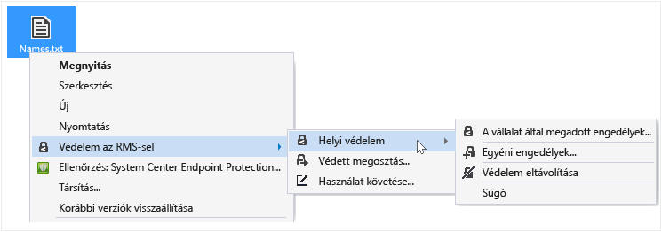
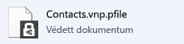
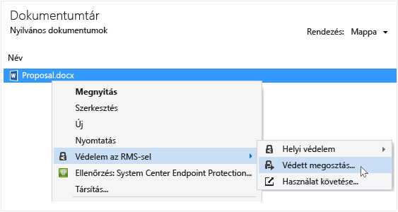
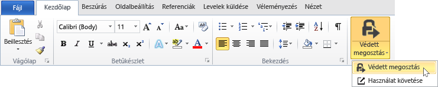
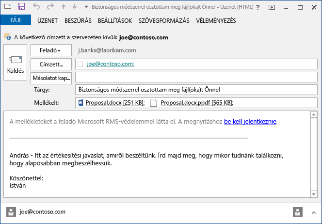
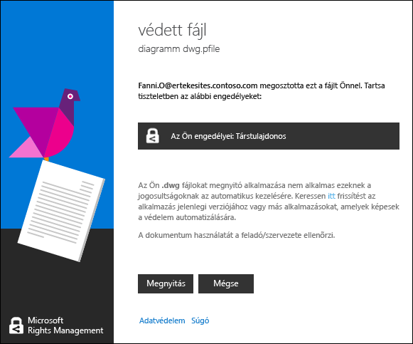
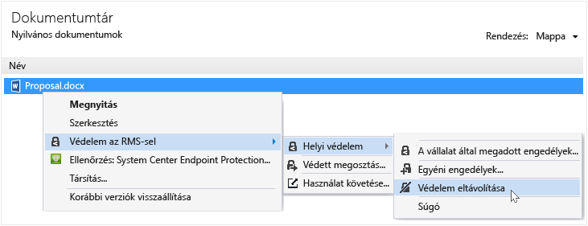
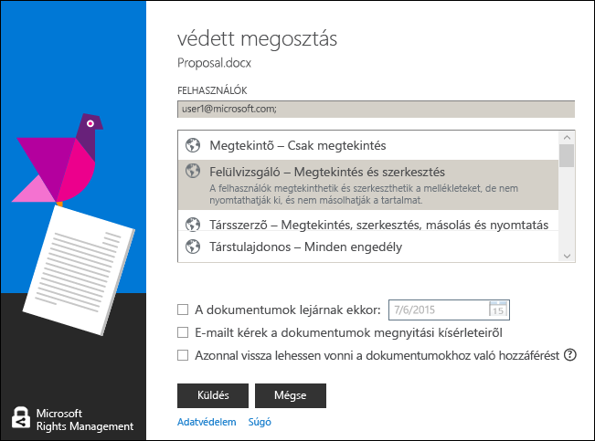

# A Rights Management megoszt&#243;alkalmaz&#225;s felhaszn&#225;l&#243;i &#250;tmutat&#243;ja – jav&#237;t&#225;s egyetlen t&#233;mak&#246;rh&#246;z
A Microsoft Rights Management (RMS) megosztóalkalmazás Windows-változata segít biztonságosan megóvni a fontos dokumentumokat és képeket az illetéktelen hozzáféréstől még akkor is, ha e-mailben küldi el vagy más eszközön osztja meg őket. Az alkalmazást használhatja mások által ugyanezen Rights Management technikával védett fájlok megnyitására és használatára is.

Az RMS megosztóalkalmazás telepítéséhez kizárólag egy legalább Windows 7 operációs rendszerű számítógépre és egy helyi rendszergazdafiókra van szüksége. Ezután [töltse le és telepítse](http://go.microsoft.com/fwlink/?LinkId=303970) ezt az ingyenes Microsoft alkalmazást.

Ha kérdéseire nem talált választ ebben az útmutatóban, tekintse meg [A Microsoft Rights Management megosztóalkalmazás Windows-változatával kapcsolatos gyakori kérdések](http://go.microsoft.com/fwlink/?LinkId=303971) című témakört.

Az alábbi néhány példa azt szemlélteti, hogy miként védheti meg fájljait a megosztóalkalmazással.

|Cél|Megoldás|
|-------|------------|
|**Pénzügyi információk biztonságos megosztása valakivel, akiben megbízom, de nem a vállalatomnál dolgozik.**  Egy partnervállalattal működik együtt, és e-mailben szeretne elküldeni nekik egy Excel-táblázatot, amely a tervezett értékesítések számait tartalmazza. Azt szeretné, hogy a számokat megtekinthessék, de megváltoztatni ne tudják.|Az Excel menüszalagján kattintson a Védett megosztás gombra, írja be annak a két személynek a nevét, akivel együttműködik a partnervállalatnál, válassza a Megtekintő lehetőséget a csúszkán, és kattintson a Küldés gombra.  Amikor az e-mail megérkezik a partnervállalathoz, csak az e-mail címzettjei tekinthetik meg a táblázatot, de menteni, módosítani, kinyomtatni és továbbítani nem tudják.  Részletek: További információt az útmutató [Mit kíván tenni?](../Topic/Rights_Management_sharing_application_user_guide_-_revision_for_single_topic.md#BKMK_UsingMSRMSApp) szakaszának **E-mailben megosztott fájl védelme** című részében talál.|
|**Dokumentum biztonságos elküldése e-mailben valakinek, aki iOS rendszerű eszközt használ.**  Szeretne e-mailben elküldeni egy szigorúan bizalmas Word-dokumentumot egy munkatársának, akiről tudja, hogy rendszeresen iOS rendszerű eszközén tekinti meg az e-mailjeit.|A Fájlkezelőben kattintson a jobb gombbal a fájlra, majd válassza a Védett megosztás parancsot. Az RMS megosztóalkalmazásban válassza a Felhasználás engedélyezése minden eszközön lehetőséget, és küldje el a fájlt mellékletként a munkatársának.  A címzett megkapja az e-mailt iOS rendszerű eszközén, rákattint az e-mailben lévő hivatkozásra, amely tudatja vele, hogyan töltse le a megosztóalkalmazást, ő telepíti az iOS rendszerű eszközökre való változatot, majd megtekinti a dokumentumot.  Részletek: További információt az útmutató [Mit kíván tenni?](../Topic/Rights_Management_sharing_application_user_guide_-_revision_for_single_topic.md#BKMK_UsingMSRMSApp) szakaszának **E-mailben megosztott fájl védelme** című részében talál.|
|**E-mailben kapott, biztonságos megosztást használó melléklet elolvasása, amelyet nem tudok megtekinteni, mert a vállalatom nem használja a Rights Management megosztóalkalmazást.**  Az e-mail küldőjében megbízik, mert régebben együtt dolgoztak, és azt gyanítja, hogy valószínűleg egy kecsegtető új üzleti lehetőségre vonatkozó információt küldött Önnek.|Kövesse az e-mailben leírt utasításokat, és a hivatkozásra kattintva iratkozzon fel a Microsoft Rights Management megosztóalkalmazásba. A Microsoft tudatja majd, hogy a vállalatának nincs előfizetése az Office 365 alkalmazáscsomagra, küld egy e-mailt, hogy hajtsa végre az ingyenes feliratkozást. Ezután lépjen be az új fiókjába. Kattintson az e-mailben található második hivatkozásra, és telepítse a Rights Management megosztóalkalmazást. Ezt követően megnyithatja az e-mail mellékletet, és tájékozódhat az új üzleti lehetőségről.  Részletek: További információt az útmutató [Mit kíván tenni?](../Topic/Rights_Management_sharing_application_user_guide_-_revision_for_single_topic.md#BKMK_UsingMSRMSApp) szakaszának **A Rights Management alkalmazással védett fájlok megtekintése és használata** című részében talál.|
|**A vállalat hordozható számítógépemen tárolt bizalmas fájljainak védelme, hogy a vállalaton kívüli személyek ne férhessenek hozzájuk.**  Sokat utazik, és hordozható számítógépével nyitja meg és frissíti a fájlokat, amelyeket egy mappában tárol, és ezt szeretné megvédeni a jogosulatlan hozzáférés ellen.|Az RMS megosztóalkalmazás telepítve van a hordozható számítógépre. Ezeket a fájlokat a Fájlkezelő segítségével védi egy sablonnal, amely gyors védelmet biztosít a fájlok számára. Ha a hordozható számítógépet ellopják, nyugodt a lelkiismerete, hogy senki nem férhet hozzá ezekhez a dokumentumokhoz.  Részletek: További információt az útmutató [Mit kíván tenni?](../Topic/Rights_Management_sharing_application_user_guide_-_revision_for_single_topic.md#BKMK_UsingMSRMSApp) szakaszának **Fájlok védelme egy eszközön (helyi védelem)** című részében talál.|

## Mit kíván tenni?
Az alábbi útmutatók segítséget nyújtanak a védett fájlokkal történő munkavégzéshez.

### A Rights Management megosztóalkalmazás letöltése és telepítése

1.  A Microsoft webhelyén navigáljon a [Microsoft Rights Management](http://go.microsoft.com/fwlink/?LinkId=303970) oldalra.

2.  A **Számítógépek** szakaszban kattintson az **RMS alkalmazás Windows rendszerre** lehetőségre, és mentse el a Microsoft Rights Management megosztóalkalmazás telepítőcsomagját a számítógépére.

3.  Kattintson duplán a letöltött tömörített fájlra, majd ismét kattintson duplán a **setup.exe** fájlra. Ha választania kell, hogy folytatja-e a telepítést, kattintson az **Igen** lehetőségre.

    > [!TIP]
    > Lehetséges, hogy a lista aljára kell görgetnie az aktuális mappában, hogy megtalálja a **setup.exe** fájlt.

4.  **A Microsoft RMS telepítése** lapon kattintson a **Tovább** gombra, majd várja meg, amíg a telepítés befejeződik.

5.  Miután a telepítő végzett, kattintson az **Újraindítás** lehetőségre, hogy a számítógép újraindításával befejezze a telepítést. Vagy kattintson a **Bezárás** lehetőségre, és később a számítógép újraindításával fejezze be a telepítést.

Most már készen áll, hogy védetté tegye fájljait, vagy elolvassa a mások által védelem alá helyezett fájlokat.

#### További információ
A megosztóalkalmazás telepítéséhez helyi rendszergazdai fiókkal kell rendelkeznie. Ha nem helyi rendszergazdaként jelentkezik be, akkor a 3. lépésben, a Setup.exe futtatásához használja a **Futtatás rendszergazdaként** lehetőséget.

### Fájl védelme egy eszközön (helyi védelem)

1.  A Fájlkezelőben válassza ki a védendő fájlt, fájlokat vagy mappát. Kattintson a jobb gombbal, és válassza a **Helyi védelem** lehetőséget. Például:

    

    > [!NOTE]
    > Ha nem látja a **Helyi védelem** lehetőséget, annak valószínű oka az, hogy a megosztóalkalmazás nincs telepítve a számítógépre, vagy a számítógépet újra kell indítani a telepítés befejezéséhez. További információt a megosztóalkalmazás telepítéséről az útmutató [Mit kíván tenni?](../Topic/Rights_Management_sharing_application_user_guide_-_revision_for_single_topic.md#BKMK_UsingMSRMSApp) szakaszának **A Rights Management megosztóalkalmazás letöltése és telepítése** című részében talál.

2.  Tegye a következők egyikét:

    -   Válasszon ki egy házirendsablont: Ezek előre definiált engedélyek, amelyek a szervezetéhez tartozó személyekre korlátozzák a hozzáférést és a használatot. Ha első alkalommal véd meg egy fájlt ezen a számítógépen, akkor a sablonok letöltéséhez először ki kell választania a **A vállalat által megadott engedélyek** lehetőséget. A sablonok neve a vállalat nevével kezdődik, majd az engedély leíró nevével folytatódik. Például: **Contoso - Csak bizalmas megtekintésre**

    -   Válassza ki az **Egyéni engedélyek** lehetőséget: Ezt a lehetőséget akkor válassza, ha a sablon nem biztosítja a szükséges védelmi szintet, például szeretne a szervezetén kívüli személyek számára hozzáférést biztosítani, vagy saját maga szeretné megadni a védelmi beállításokat. A **védelem hozzáadása** párbeszédpanelen adja meg a fájlhoz a kívánt beállításokat, majd kattintson az **Alkalmaz** gombra.

        > [!NOTE]
        > A párbeszédpanel beállítási lehetőségeiről további információt az útmutató [Mit kíván tenni?](../Topic/Rights_Management_sharing_application_user_guide_-_revision_for_single_topic.md#BKMK_UsingMSRMSApp) szakaszának **Beállítások megadása a Rights Management párbeszédpanelen** című részében talál.

3.  Előfordulhat, hogy egy rövid időre megjelenő párbeszédpanel tájékoztatja, hogy a fájl védelme folyamatban van, majd ismét a Fájlkezelő kerül előtérbe. A kiválasztott fájl vagy fájlok most már védettek. Bizonyos esetekben (amikor a védelem alá helyezésnél megváltozik a fájlnévkiterjesztés) a Fájlkezelőben az eredeti fájl helyére egy új fájl kerül, amelyen a Rights Management védelem lakat ikonja látható. Például:

    

Ha később el kell távolítania a fájl védelmét, akkor az útmutató [Mit kíván tenni?](../Topic/Rights_Management_sharing_application_user_guide_-_revision_for_single_topic.md#BKMK_UsingMSRMSApp) szakaszának **Védelem eltávolítása egy fájlról** című részében talál további útmutatást.

#### További információ
Amikor helyben tesz védetté egy fájlt, akkor a fájl felülírja az eredeti, nem védett fájlt. Ezután akár ugyanazon a helyen hagyja a fájlt, akár átmásolja egy másik mappába vagy eszközre, akár megosztja a fájlt tartalmazó mappát, a fájl már védett lesz. A fájl hozzácsatolhatja egy e-mail üzenethez, habár e-mailben javasolt közvetlenül a Fájlkezelőből, vagy egy Office alkalmazásból megosztani a fájlokat (lásd az útmutató [Mit kíván tenni?](../Topic/Rights_Management_sharing_application_user_guide_-_revision_for_single_topic.md#BKMK_UsingMSRMSApp) szakaszának **E-mailben megosztott fájlok védelmének biztosítása** című részét).

Ugyanezzel a módszerrel egyszerre több fájlt vagy egy mappát is védetté tehet. Ha védetté tesz egy mappát, a mappában található minden fájl automatikusan védett lesz, a mappában létrehozott új fájlok azonban nem válnak automatikusan védetté.

Ha a fájlok védelme közben bármilyen hibát észlel, tekintse meg [A Microsoft Rights Management megosztóalkalmazás Windows-változatával kapcsolatos gyakori kérdések](http://go.microsoft.com/fwlink/?LinkId=303971) című témakört.

### E-mailben megosztott fájlok védelmének biztosítása

1.  Használja az alábbi lehetőségek egyikét:

    -   A Fájlkezelő esetén: Kattintson a jobb gombbal a fájlra, és válassza a **Helyi védelem** lehetőséget:

        

    -   Office-alkalmazásokban: Előbb ellenőrizze, hogy mentette-e a fájlt. Ezután a **Védelem** csoportban kattintson a **Védett megosztás** lehetőségre.

        

    > [!NOTE]
    > Ha nem jelennek meg ezek a védett megosztási lehetőségek, lehetséges, hogy nincs telepítve a megosztóalkalmazás a számítógépen, vagy újra kell indítania a számítógépet a telepítés befejezéséhez. További információt a megosztóalkalmazás telepítéséről az útmutató [Mit kíván tenni?](../Topic/Rights_Management_sharing_application_user_guide_-_revision_for_single_topic.md#BKMK_UsingMSRMSApp) szakaszának **A Rights Management megosztóalkalmazás letöltése és telepítése** című részében talál.

2.  A **védelem hozzáadása** párbeszédpanelen adja meg a fájlhoz a kívánt beállításokat, majd kattintson a **Küldés** gombra.

    

    > [!NOTE]
    > A párbeszédpanel beállítási lehetőségeiről további információt az útmutató [Mit kíván tenni?](../Topic/Rights_Management_sharing_application_user_guide_-_revision_for_single_topic.md#BKMK_UsingMSRMSApp) szakaszának **Beállítások megadása a Rights Management párbeszédpanelen** című részében talál.

3.  Rövid időre megjelenhet egy párbeszédpanel, amely arról tájékoztat, hogy a fájl védetté tétele folyamatban van, majd megjelenik egy e-mail üzenet, amelyet az alkalmazás hozott létre az Ön számára, a következő tárgysorral: **Biztonságos módszerrel osztottam meg fájl(oka)t Önnel**. Ehhez az e-mailhez csatolva lesz a kiválasztott védett fájl, és az e-mail szövege hivatkozásokat tartalmaz az alábbiakhoz:

    -   RMS egyéni felhasználók számára

    -   Az RMS megosztóalkalmazás

    -   A jelen felhasználói útmutató

    Példa:

    

4.  Választható lehetőség: Az e-mail üzenetben megváltoztathat bármit, amit akar. Megadhatja vagy megváltoztathatja például az üzenet szövegét vagy az e-mail tárgyát.

    > [!WARNING]
    > Bár felvehet vagy eltávolíthat személyeket az e-mail címzettjei közül, ez nem változtatja meg a mellékletre vonatkozó, a **védett megosztás** párbeszédpanelen megadott engedélyeket. Ha meg szeretné változtatni a jogosultságokat, például egy új címzettnek szeretne fájlmegnyitási engedélyt adni, zárja be az e-mail üzenetet mentés és elküldés nélkül, és ugorjon az 1. lépésre.

5.  Küldje el az e-mailt.

#### További információ
Ha védelemmel lát el egy e-mailben megosztott fájlt, az alkalmazás az eredeti fájl egy új változatát hozza létre. Az eredeti fájl védetlen marad, az új változat pedig védett lesz, és automatikusan egy később elküldött e-mailhez lesz csatolva.

Az e-mail alapértelmezett tárgysorral és szöveggel rendelkezik, ezeket küldés előtt módosíthatja.

Kétféleképpen teheti védetté az e-mailben megosztott fájlokat:

-   A Fájlkezelőből: Ez a módszer minden fájl esetében használható.

-   Valamelyik Office-alkalmazásból: Ez a módszer azon alkalmazások esetében működik, amelyeket a Rights Management megosztóalkalmazás az Office-bővítmény használatával támogat, így a **Védelem** csoportot a menüszalagon láthatja.

> [!NOTE]
> A Rights Management megosztóalkalmazásnak ebben a verziójában nincs bővítmény az Outlookhoz, amellyel közvetlenül az Outlookból tehetné védetté a fájlokat és az e-maileket. Ehelyett használja az ebben a szakaszban ismertetett eljárást.

### A Rights Managementtel védett fájlok megtekintése és használata

#### Védett fájl megtekintése
A Fájlkezelőben vagy a mellékletet tartalmazó e-mail üzenetben kattintson duplán a védett fájlra, és amikor az alkalmazás kéri, adja meg a hitelesítő adatait. A fájl többféleképpen nyitható meg, attól függően, hogy milyen védelemmel látták el.

-   Ha a fájlt általános védelemmel látták el (.pfile kiterjesztése van):

    Megjelenik a megosztóalkalmazás **védett fájl** párbeszédablaka, amely ismerteti a fájlt védetté tevő személy nevét, és kéri a társszerzői engedélyek tiszteletben tartását. A panelen arról is tájékozódhat, hogy a fájl megnyitásakor a rendszer naplózza ezt a műveletet.

    

    A fájl elolvasásához kattintson a **Megnyitás** lehetőségre.

-   Ha a fájlt natív védelemmel látták el (nincs .pfile kiterjesztése):

    A fájl az eredeti fájlnévkiterjesztéséhez társított alkalmazásban nyílik meg, és a fájl elején megjelenik egy korlátozásról tájékoztató szalagcím. A szalagcím megjelenítheti a fájlra alkalmazott engedélyeket, vagy tartalmazhat egy hivatkozást is a megjelenítésükhöz. Például előfordulhat, hogy a következőt látja, ahol az **Az engedélyek korlátozottak** lehetőségre kattintva megtekintheti a fájlra és a fáljhozzáféréssel rendelkező személyekre vonatkozó tényleges engedélyeket:

    

    A rendszer ezt a fájlt szintén naplózza, és amíg védett marad, naplózni is fogja.

##### További információ
Mielőtt megtekinthetné a védett fájlt, az RMS-nek meg kell győződnie arról, hogy Ön jogosult erre, amit a felhasználónév és a jelszó ellenőrzésével végez el. Bizonyos esetekben a rendszer ezt gyorsítótárazhatja, és ekkor nem kéri a hitelesítő adatok megadását. Más esetekben kérni fogja a hitelesítő adatok megadását.

Ha a szervezete nem használja a Microsoft Azure Rights Management (Microsoft Azure RMS) vagy AD RMS szolgáltatást, kérhet egy ingyenes fiókot, amely elfogadja a hitelesítő adatait, hogy megnyithasson RMS használatával védetté tett fájlokat. A fiókot a következő hivatkozásra kattintva kérvényezheti: [RMS egyéni felhasználók számára](http://go.microsoft.com/fwlink/?LinkId=309469).

#### A védett fájlok használata (például szerkesztése vagy nyomtatása)
Ha a védett fájl fájlkiterjesztése .pfile:

-   Mentse a megnyitott fájlt olyan fájlnévkiterjesztéssel, amely a használni kívánt alkalmazáshoz van hozzárendelve.

    Ha például a fájl document.vsdx.pfile néven lett védetté téve, tekintse meg a fájlt, és a Fájlkezelőben mentse document.vsdx néven.

    Az új fájl már nem védett. Ha védelemmel szeretné ellátni, azt manuálisan kell megtennie. További információt az útmutató [Mit kíván tenni?](../Topic/Rights_Management_sharing_application_user_guide_-_revision_for_single_topic.md#BKMK_UsingMSRMSApp) szakaszának **Fájlok védelme egy eszközön (helyi védelem) a Rights Management megosztóalkalmazással** című részében talál.

Ha az eredetileg védett fájlnak nem volt .pfile kiterjesztése:

-   A fájl megtekintésén kívül nem tehet semmi mást, kivéve, ha olyan alkalmazása van, amely kompatibilis a Rights Management szolgáltatással. Ezeket az alkalmazásokat Rights Management-kompatibilis alkalmazásoknak nevezzük. Rights Management-kompatibilis alkalmazások például az Office 2013 és az Office 2010 alkalmazásai (a Word, az Excel, a PowerPoint és az Outlook). Ugyanakkor a nem Microsoft-alkalmazások, például más szoftvergyártók vagy saját üzletági alkalmazásai is kompatibilisek lehetnek a Rights Management szolgáltatással.

    A Rights Management-kompatibilis alkalmazások meg tudják nyitni a más Rights Management-kompatibilis alkalmazásokban védetté tett fájlokat. Továbbá megőrzik a fájlokra alkalmazott védelmet, még a fájl szerkesztése, illetve más néven vagy más helyre történő mentése esetén is. Ezek az alkalmazások lehetővé teszik, hogy a fájlt az aktuálisan érvényes engedélyeinek megfelelően használja, így ha Ön rendelkezik engedéllyel a fájl használatára, akkor azt megteheti. Ha például a fájl írásvédett, nem fogja tudni módosítani vagy kinyomtatni.

### Fájl védelmének megszüntetése
A Fájlkezelőben kattintson a jobb gombbal a fájlra (például a Minta.ptxt fájlra), majd kattintson a **Helyi védelem**, végül pedig a **Védelem eltávolítása** lehetőségekre:

Előfordulhat, hogy az alkalmazás kéri a hitelesítő adatok megadását.

#### További információ
A rendszer törli az eredeti védett fájlt (például a Minta.ptxt fájlt), és lecseréli egy ugyanolyan nevű, de nem védett fájlkiterjesztésű fájllal (például a Minta.txt fájllal).

Egy korábban RMS-megosztó alkalmazással védelem alá helyezett fájl védelmének eltávolításához (azaz a védelem feloldásához) a Fájlkezelőben használja a **Védelem eltávolítása** lehetőséget.

> [!IMPORTANT]
> A védelmet csak a fájl tulajdonosaként távolíthatja el.

### Billentyűparancsok használata a Rights Management megosztóalkalmazásban
Az **Alt** billentyű megnyomásával megtekintheti az elérhető hívóbetűket, majd az **Alt** + a hívóbetű kombinációjával kiválaszthatja a beállítást.

#### További információ
Például a **védett megosztás** párbeszédpanelen az **Alt** billentyű lenyomásával megtekintheti a hívóbillentyűket, majd az **Alt + u** billentyűkombinációval bejelölheti az **A felhasználóknak be kell jelentkezniük minden alkalommal, amikor megnyitják a fájlt** lehetőség jelölőnégyzetét.

### Beállítások megadása a Rights Management párbeszédpanelen

|Beállítás|Leírás|
|-------------|----------|
|**FELHASZNÁLÓK**|Írja be azon személyek e-mail címét, akiknek engedélyezni szeretné a fájl megnyitását. A címeket pontosvesszővel válassza el egymástól. Az e-mail címek a szervezeten belüli vagy kívüli címek is lehetnek.  Például: janetm@contoso.com; pdover@fabricom.com|
|**Felhasználás engedélyezése minden eszközön**|Ha ezt a lehetőséget választja, amellyel engedélyezi, hogy a felhasználók az iPadhez hasonló mobileszközökön is megnyissák a fájlt, automatikusan a **TÁRSTULAJDONOS** engedélyek (minden engedély) lépnek érvénybe, és a fájl általános védelemmel lesz ellátva.|
|**ENGEDÉLYEK**|Mozgassa a csúszkát a fájlhoz használni kívánt engedélyre.  Bizonyos esetekben az engedélyek automatikusan a TÁRSTULAJDONOS értéket kapják, és ez nem módosítható. Ez akkor történik, ha a **Felhasználás engedélyezése minden eszközön** beállítást használja. Akkor is megtörténhet, ha az RMS natív védelmével nem védhető fájlt szeretne védetté tenni, így az általános védelmet választja. A megosztóalkalmazás ezt a fájlnévkiterjesztés alapján dönti el. **Tip:** A Microsoft webhely [Microsoft Rights Management](http://go.microsoft.com/fwlink/?LinkId=303970) oldalán gyorsan ellenőrizheti, hogy mely alkalmazások támogatják ezt a beépített védelmet.|
|**A felhasználóknak a fájl megnyitásakor minden alkalommal be kell jelentkezniük**|Jelölje be ezt a jelölőnégyzetet, ha magasabb biztonsági szint szükséges a fájlhoz, mivel a megadott felhasználóknak mindig hitelesítést kell végezniük, amikor hozzá szeretnének férni a fájlhoz. Ehhez, ha a hitelesítő adataik nincsenek gyorsítótárazva, az alkalmazás kérni fogja a felhasználónevüket és a jelszavukat. Azonban ez a beállítás megköveteli, hogy a felhasználók mindig rendelkezzenek internet-hozzáféréssel a fájl megnyitásához. A fájlzárolás feloldásának kérése és a hitelesítési folyamat befejezésének kivárása pedig kellemetlen lehet.|
|**A tartalom elévülési ideje**|Ezt a lehetőséget csak az olyan időérzékeny fájlokhoz válassza, amelyeket a kiválasztott felhasználók a megadott dátum után már nem nyithatnak meg. Ön természetesen ezután is megnyithatja az eredeti fájlt.|

#### További információ
A táblázat segítségével megadhatja a megosztóalkalmazás **védelem hozzáadása** vagy **védett megosztás** párbeszédpanelén a szükséges beállításokat. Ez a párbeszédpanel akkor jelenik meg, ha a fájlt helyi védelemmel látja el, és egyéni engedélyeket választ, vagy ha megosztandó fájlt tesz védetté.

További információt a fájlok helyi védelméről és a védett fájlmegosztásról az útmutató [Mit kíván tenni?](../Topic/Rights_Management_sharing_application_user_guide_-_revision_for_single_topic.md#BKMK_UsingMSRMSApp) című szakaszában talál.

## Lásd még
[A Rights Management megosztási alkalmazás rendszergazda guide](../Topic/Rights_Management_sharing_application_administrator_guide.md)
 [A Microsoft Rights Management megosztóalkalmazás letöltése](http://go.microsoft.com/fwlink/?LinkId=303970)
 [A Windows Microsoft Rights Management megosztóalkalmazással kapcsolatos gyakori kérdések](http://go.microsoft.com/fwlink/?LinkId=303971)

