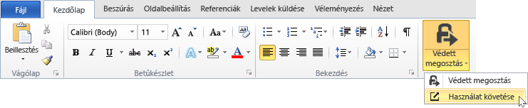
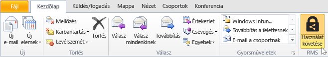
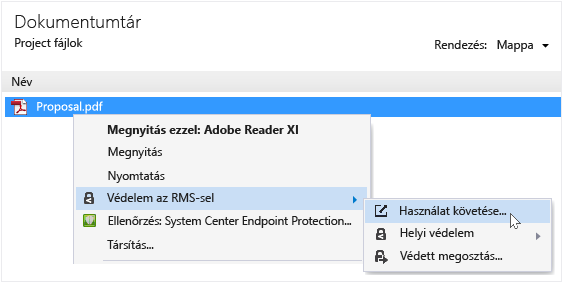
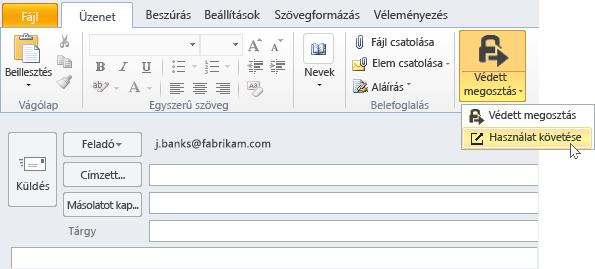

# Nyomon k&#246;vet&#233;se, &#233;s a dokumentumok visszavonni, az RMS-megoszt&#243; alkalmaz&#225;s haszn&#225;lata eset&#233;n
Után a dokumentumok védelme, ha az RMS-megosztó alkalmazás, ha a szervezet használja az Active Directory tartalomvédelmi szolgáltatások helyett Azure Rights Management használatával, a személyek hogyan használja a védett dokumentumok is követheti. Szükség esetén is vonhatja ezeket a dokumentumokat a hozzáférést, ha le szeretné állítani a megosztás őket. Ehhez használja a **hely követési dokumentum**, amely a Windows rendszerű számítógép, Mac-számítógépek, és még táblagépek és telefonok érheti el.

> [!TIP]
> Két perc videó: [Azure RMS-dokumentum követési és visszavonása](http://channel9.msdn.com/Series/Information-Protection/Azure-RMS-Document-Tracking-and-Revocation)

Amikor ezen a webhelyen fér hozzá, jelentkezzen be a dokumentumok nyomon követésére. A szervezet mutató van egy [előfizetés, amely támogatja a dokumentum követési és a visszavont tanúsítványok](https://technet.microsoft.com/dn858608.aspx) és a hozzá van rendelve a licenc az előfizetés, majd megtekintheti ki próbált meg, akkor a védett fájlok megnyitása, és hogy jártak sikerrel (azok voltak sikeresen hitelesített) vagy sem. Minden alkalommal azok megpróbált hozzáférni a dokumentum, és a helyük időpontjában. Ezenkívül:

-   Ha le kell állítania a megosztott dokumentumot: Kattintson a **hozzáférésének megvonása**, vegye figyelembe, hogy a dokumentum továbbra is elérhető, és úgy dönt, hogy tudathatja másokkal, hogy Ön visszavonja a dokumentum való hozzáférés meg a korábban megosztott, és adjon meg egy testreszabott üzenet időn.

-   Ha az Excel exportálni kívánt: Kattintson a **Nyissa meg az Excel**, hogy az adatok módosítása, majd a saját nézeteket és diagramok létrehozása.

-   Ha azt szeretné, e-mail értesítések konfigurálása: Kattintson a **Beállítások** és válassza ki, hogy miként, és hogy a kell küldve, ha érhető el a dokumentum-e.

-   Ha kérdése van, vagy a hely követési dokumentummal kapcsolatos visszajelzés: Kattintson a súgó ikon eléréséhez a [gyakran ismételt kérdések a dokumentum követési](http://go.microsoft.com/fwlink/?LinkId=523977).

## Office használatával megnyitni a dokumentumot, hely nyomon követése

-   Az Office alkalmazások, a Word, Excel és PowerPoint: Az a **kezdőlap** lapon, a a **RMS** csoportjában kattintson **védett megosztás**, és kattintson a **nyomon követése használati**.

    

-   Az Outlook: Az a **kezdőlap** lapon, a a  **RMS** csoportjában kattintson **nyomon követése használati**:

    

Ha ezek a beállítások az RMS szolgáltatást nem látja, valószínű, hogy az RMS-megosztó alkalmazás nincs telepítve a számítógépen, a legújabb verzióra nincs telepítve, vagy a telepítés befejezéséhez újra kell indítani a számítógépet. A megosztóalkalmazás telepítésével kapcsolatos további tudnivalókért tekintse meg a [Töltse le és telepítse a Rights Management megosztóalkalmazás](../Topic/Download_and_install_the_Rights_Management_sharing_application.md).

### Más módon nyomon követésére és a dokumentumok visszavonása
Kívül dokumentumok nyomon követése a Windows rendszerű számítógép által az Office-alkalmazásokat használ, másik módszert is használható:

-   **Webböngészővel**: Ez a módszer használható minden támogatott eszközökhöz.

-   **Fájl Intéző használatával**: Ez a módszer használható a Windows rendszerű számítógépeken.

-   **Használatával az Outlook e-mailben**: Ez a módszer használható a Windows rendszerű számítógépeken.

##### A doc követési webhely eléréséhez böngészővel

-   Támogatott böngészővel, nyissa meg a [hely követési dokumentum](http://go.microsoft.com/fwlink/?LinkId=529562).

    A támogatott böngészők: Javasoljuk, hogy a Internet Explorer, amely legalább 10-es verzióját, de bármelyike használható alábbi böngészőket használni a webhely követési dokumentumot:

    -   Az Internet Explorer: Legalább 10-es verzió

    -   Az Internet Explorer 9 rendelkező legalább MS12-037: Összesített frissítés az Internet Explorer: 2012. június 12.

    -   Mozilla Firefox: Legalább verziója 12

    -   Az Apple Safari 5: Legalább 5-ös verzióját

    -   Google Chrome: Legalább 18. verziója

##### Fájl Intéző használatával a doc követési hely elérésére.

-   Kattintson a jobb gombbal a fájlt, jelölje be **védelme az RMS**, majd válassza ki **nyomon követése használati**:

    

##### Az Outlook e-mailben használatával a doc követési hely elérésére.

-   Az e-mail üzenet a a **üzenet** lapon, a a  **RMS** csoportjában kattintson **védett megosztás**, és kattintson a **nyomon követése használati**:

    

## Példák és más utasítások
Előfordulhat, hogy hogyan használhatja a Rights Management megosztó alkalmazás- és útmutató utasításokat a, tekintse meg az alábbi szakaszok a Rights Management megosztási alkalmazás felhasználói útmutató:

-   [Példák az RMS-megosztó alkalmazás használatával](../Topic/Rights_Management_sharing_application_user_guide.md#BKMK_SharingExamples)

-   [Választható?](../Topic/Rights_Management_sharing_application_user_guide.md#BKMK_SharingInstructions)

## Lásd még
[A Rights Management megosztási alkalmazás felhasználói útmutató](../Topic/Rights_Management_sharing_application_user_guide.md)

