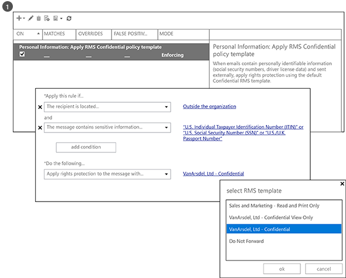
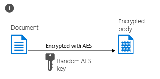

# Mi az Azure Rights Management?
Az Azure Rights Management (Azure RMS) az adataikat a mai kihívást működő környezethez védeni kívánt szervezetek adatvédelmi megoldás.

Ezek a kihívások felvétele a kell lenniük az internethez csatlakozó felhasználókkal történő visszaállítását személyes eszköz használatát közúti és otthoni vállalati adatok elérése és fontos üzleti partnerekkel bizalmas információk megosztása A napi munkához részeként felhasználók információikat e-mail fájlmegosztási helyek használatával, és a felhőalapú szolgáltatások. A fenti esetekben hagyományos biztonsági funkciók (például a hozzáférés-vezérlési listák és NTFS-engedélyek) és a tűzfalak korlátozott hatékonyságának Ha azt szeretné, miközben továbbra is járjon el a felhasználókat, hogy hatékonyan működjön a vállalati adatok védelme érdekében.

Összehasonlítás Azure RMS védelmet biztosíthat a vállalat bizalmas adatok ezeket a forgatókönyveket. Titkosítás, az identity és engedélyezési házirendeket használja a biztonságossá a fájlok és az e-mailt, és többféle eszközön működik – telefonok, táblagépek és számítógépek. Adatok védelme biztosítható a szervezeten belül, mind a szervezeten kívüli, mert a védett marad az adatokat, akkor is, ha a szervezet határok hagyja. Például egy alkalmazottak előfordulhat, hogy e-mail dokumentum partner vállalatnak, vagy a dokumentum mentése a felhő meghajtóra. Az Azure RMS biztosító állandó védelmi nemcsak segít biztosítani a vállalati adatok, de előfordulhat, hogy is lehet jogszerűen eszközben lehet megbízást adni a megfelelőségi, jogi felderítési követelmények vagy egyszerűen helyes információt felügyeleti eljárásokat.

De nagyon fontos, a hitelesített felhasználók és a szolgáltatások (például a keresési és indexelési) továbbra is olvassa el és vizsgálja meg az adatok Azure RMS védő, amely nem könnyen valósítható meg a társ-társ titkosítást használó más adatvédelmi megoldásaival. Ez a lehetőség van más néven "indoklást át adatokat", és karbantartása a szervezet adatainak ellenőrzése fontos eleme.

Az alábbi képen látható Azure RMS működése megoldás a Rights Management az Office 365 rendszerre, valamint a helyszíni kiszolgálók és a szolgáltatások. Azt is látni fogja, hogy támogatja-e a Windows, Mac OS, iOS, Android és Windows Phone rendszerű népszerű végfelhasználói eszközök.

> [!TIP]
> Ezen a ponton akkor lehet hasznos a további erőforrások:
> 
> -   Két perc videó: [Mi az a Microsoft Azure Rights Management](http://technet.microsoft.com/dn833005.aspx)
> -   5. lépés – oktatóanyag: [Rövidített oktatóprogram Azure Rights Management](../Topic/Quick_Start_Tutorial_for_Azure_Rights_Management.md)
> -   Az Azure RMS követelményeit, beleértve az előfizetési lehetőségek megvásárlása vagy kiértékelése: [Az Azure Rights Management követelményei](../Topic/Requirements_for_Azure_Rights_Management.md)

A következő részekben további tudnivalók az Azure RMS:

-   [Milyen problémák megoldani Azure RMS?](../Topic/What_is_Azure_Rights_Management_.md#BKMK_RMSrequirements)

    -   [Biztonság, a megfelelőségi és szabályozási előírások](../Topic/What_is_Azure_Rights_Management_.md#BKMK_RMScompliance)

-   [A művelet az Azure RMS: A rendszergazdák és felhasználók lásd](../Topic/What_is_Azure_Rights_Management_.md#BKMK_RMSpictures)

    -   [Aktiválása és Rights Management konfigurálása](../Topic/What_is_Azure_Rights_Management_.md#BKMK_Example_ManagementPortal)

    -   [Automatikusan a Windows Server és a fájl besorolást infrastruktúra futtató fájlkiszolgálók fájljainak védelme](../Topic/What_is_Azure_Rights_Management_.md#BKMK_Example_FCI)

    -   [E-maileket az Exchange Online és adatok elvesztése megelőzésére házirendek automatikusan védelme](../Topic/What_is_Azure_Rights_Management_.md#BKMK_Example_DLP)

    -   [Automatikusan a SharePoint online-hoz és a védett könyvtárak és fájlok védelme](../Topic/What_is_Azure_Rights_Management_.md#BKMK_Example_SharePoint)

    -   [Az utazó felhasználók biztonságos megosztása mellékletek felhasználók](../Topic/What_is_Azure_Rights_Management_.md#BKMK_Example_SharingApp)

-   [Hogyan működik az Azure RMS? A zárt alatt](../Topic/What_is_Azure_Rights_Management_.md#BKMK_HowRMSworks)

    -   [Azure RMS által használt titkosítási funkciókhoz: Algoritmusokat és kulcshosszokat](../Topic/What_is_Azure_Rights_Management_.md#BKMK_RMScrytographics)

    -   [A forgatókönyv Azure RMS működése: Először használja, a tartalom védelmi tartalom fogyasztás](../Topic/What_is_Azure_Rights_Management_.md#BKMK_Walthrough)

-   [Az alábbi lépéseket](../Topic/What_is_Azure_Rights_Management_.md#BKMK_NextSteps)

## Milyen problémák megoldani Azure RMS?
Az alábbi táblázat az üzleti igényeknek és a problémák esetében előfordulhat, hogy a szervezet azonosításához, és hogyan Azure RMS is oldja meg ezeket használja.

|Követelmény vagy probléma|Az Azure RMS által megoldott|
|-----------------------------|--------------------------------|
|Minden fájltípushoz védelmet.|√ natív védelemmel Rights Management csak Office-fájlok sikerült védeni, előző végrehajtása során. Most [Általános védelmet](https://technet.microsoft.com/library/dn574738%28v=ws.10%29.aspx) azt jelenti, hogy minden fájltípushoz támogatottak.|
|Tetszőleges fájlok védelme|√, ha egy fájlt egy olyan helyre menti a rendszer ([helyi védelem](https://technet.microsoft.com/library/dn574733%28v=ws.10%29.aspx)), a védelem marad a fájl, akkor is, ha nem az ellenőrzése alatt álló tárolók másolódik informatikai, például a tároló felhőszolgáltatást.|
|Fájlok biztonságos megosztása e-mailben|Ha e-mailben megosztott fájl √ ([védett megosztás](https://technet.microsoft.com/library/dn574735%28v=ws.10%29.aspx)), a fájl védett e-mailben, utasításokat mellékletként megnyitása a védett mellékletet. Az e-mail szövege nincs titkosítva, ezért a címzett mindig olvassa el az utasításokat. Azonban, mert a csatolt dokumentum védett, csak a hitelesített felhasználóknak fogja tudni megnyitni a dokumentumot akkor is, ha az e-mailben vagy dokumentum mások továbbítja.|
|Naplózás és a figyelés|√ is [naplózási és felhasználásának figyelésére](https://technet.microsoft.com/library/dn529121.aspx) a védett fájlok, ezeket a fájlokat, hagyja üresen a szervezet határok után is.  Például a Contoso, Ltd. működik A Fabrikam, Inc. 3 személyek közös projekten dolgozik 3 címzetteknél e-mail a dokumentum védelmére, és korlátozhatja a csak olvasható. Az Azure RMS naplózási megadhatja a következő információkat:  -   -E az Ön által megadott Fabrikam személyek megnyitni a dokumentumot, és ha. -   E nem adott meg, hogy mások próbált (és nem sikerült) a dokumentum megnyitásához – talán mert lett továbbítva vagy mások által hozzáférhető megosztott helyre menti. -   Hogy a megadott személyeknek bármelyike próbált (és nem sikerült) nyomtatás, vagy a dokumentum módosításához.|
|Az összes támogatási általánosan használt eszközök, nem csak a Windows rendszerű számítógépek|√ [támogatott eszközök](https://technet.microsoft.com/library/dn655136.aspx) a következők:  -   Windows-számítógépek és telefonok -   Mac számítógépek -   iOS táblagépeken és telefonokon -   Android rendszerű táblagépek és telefonok|
|A vállalatok együttműködés támogatása|√ Mert Azure RMS egy felhőalapú szolgáltatás, explicit módon konfigurálása bizalmi kapcsolatok más vállalatokkal, mielőtt védett tartalom megoszthatja velük nincs szükség. Ha már az Office 365 vagy egy Azure Active directory automatikusan támogatott szervezetek közötti együttműködés. Ha nem, felhasználók feliratkozhat az ingyenes [RMS egyéni felhasználók számára](https://technet.microsoft.com/library/dn592127.aspx) előfizetés.|
|A helyszíni szolgáltatások, valamint az Office 365 támogatása|√ használata mellett [zökkenőmentesen és az Office 365](https://technet.microsoft.com/library/jj585004.aspx), is használhatja Azure RMS és a következő helyszíni szolgáltatások telepítésekor a [RMS összekötő](https://technet.microsoft.com/library/dn375964.aspx):  -   Exchange-kiszolgáló -   SharePoint-kiszolgáló -   Windows Server fájl besorolást infrastruktúra fut|
|Egyszerű aktiválás|√ [a Rights Management szolgáltatás aktiválása](https://technet.microsoft.com/library/jj658941.aspx) felhasználók szükséges, hogy csak néhány kattintással hagyományos Azure portálon.|
|Szükség szerint a szervezeten belüli méretezési képességét|√ Mert Azure RMS Alkalmazást futtató felhő alapú szolgáltatásként a Azure rugalmassága méretezési be és ki, nem kell kiépíteni, vagy további helyszíni kiszolgálók telepítése.|
|Egyszerű és rugalmas házirendek létrehozása|√ [Jogmegadási sablonok testreszabott](https://technet.microsoft.com/library/dn642472.aspx) gyors és egyszerű megoldást nyújt a rendszergazdáknak alkalmazni a házirendeket, és alkalmazza a megfelelő szintű védelem minden egyes dokumentumhoz, és a hozzáférés korlátozása a szervezeten belüli felhasználók számára.  Például a vállalati szintű stratégia papír minden alkalmazott megosztását, a sikerült telepítenie egy csak olvasható házirend belső az alkalmazottak. Ezt követően érzékenyebb dokumentum, például a pénzügyi jelentés sikerült korlátozza igazgatók csak való hozzáférést.|
|Átfogó alkalmazás támogatása|√ Azure RMS szoros integrálni kell a Microsoft Office alkalmazásokat és szolgáltatásokat, és más alkalmazások támogatása kiterjeszti az RMS-megosztó alkalmazás használatával.  √ a   [Microsoft Rights Management SDK](https://msdn.microsoft.com/library/hh552972%28v=vs.85%29.aspx) API-k, amelyek támogatják az Azure RMS egyéni alkalmazások írni a belső fejlesztők és szoftvergyártók biztosít.  További információ: [Hogyan alkalmazások támogatják a Azure Rights Management](../Topic/How_Applications_Support_Azure_Rights_Management.md).|
|Informatikai be kell tartaniuk a vezérlési adatok|√ Szervezetek kiválaszthatják, hogy a saját bérlői kulcs, és használja a "[kerüljön a saját kulcs](https://technet.microsoft.com/library/dn440580.aspx)" (BYOK) megoldást, és a bérlő kulcs hardveres biztonsági modulok (HSMs) tárolja.  √ Támogatja a naplózás és [használat naplózása](https://technet.microsoft.com/library/dn529121.aspx) visszaélés, figyelje, hogy az üzleti insights elemezheti, és (ha van olyan információkat memóriavesztés) elemezhetjük eseményeknél.  √ Meghatalmazott hozzáférés használatával a [felügyelői funkció](https://technet.microsoft.com/library/mt147272.aspx) biztosítja, hogy az informatikai részleg mindig hozzáférési védett-e tartalmat, még akkor is, ha a dokumentum védett alkalmazottja, aki a szervezet majd hagyja. Társ-társ titkosítási megoldások kockázat elveszett vállalati adatok elérésének szemben.  √ Szinkronizálása [csak az Azure RMS kell címtárattribútumok](https://azure.microsoft.com/documentation/articles/active-directory-aadconnectsync-attributes-synchronized/) közös identitással a helyszíni Active Directory-fiókok használatával támogatására egy [címtár-Szinkronizáló eszköz](https://azure.microsoft.com/documentation/articles/active-directory-aadconnect-get-started-tools-comparison/), például az Azure AD Connect.  √ egyetlen aláírása engedélyezze a jelszavak replikálja a felhőbe, az AD FS használatával nélkül.  √ Szervezetek mindig, hogy leállítja az Azure RMS segítségével korábban Azure RMS által védett tartalom való hozzáférés elvesztése nélkül. Beállítások leszerelése kapcsolatos információkért lásd: [Leállítására, és az Azure Rights Management inaktiválásáról](../Topic/Decommissioning_and_Deactivating_Azure_Rights_Management.md). Emellett a szervezetek számára, akik telepítették az Active Directory tartalomvédelmi szolgáltatások (AD RMS) is [át az Azure RMS](https://technet.microsoft.com/library/dn858447.aspx) elvesztését access adatokat, amelyek korábban védelem által az Active Directory tartalomvédelmi szolgáltatások nélkül.|
> [!TIP]
> Ha ismeri a Rights Management, az Active Directory tartalomvédelmi szolgáltatások (AD RMS), a helyszíni verzióját az összehasonlítás tábla érdeklik valószínűleg [Azure Rights Management és az Active Directory tartalomvédelmi szolgáltatások összehasonlítása](../Topic/Comparing_Azure_Rights_Management_and_AD_RMS.md).

### Biztonság, a megfelelőségi és szabályozási előírások
Az Azure RMS támogatja a következő biztonsági, a megfelelőség és a szabályozási követelmények:

√ szabványos titkosítást és támogatja a FIPS 140-2 használja. További információ: a [Azure RMS által használt titkosítási funkciókhoz: Algoritmusokat és kulcshosszokat](../Topic/What_is_Azure_Rights_Management_.md#BKMK_RMScrytographics) című szakaszában talál.

√ Thales hardveres biztonsági modulok Microsoft Azure data a bérlő kulcsot tárolni (HSMs) támogatása erőforrások. Az Azure RMS külön biztonsági világot a kulcsok használhatók csak az adott régióban, Észak-amerikai, EMEA (Európa, közel-keleti és Afrika) és Ázsiában, az adatközpontok használ.

√ Certified for a következőket:

-   ISO/IEC 27001:2013 (tartalmazza a [ISO/IEC 27018](http://azure.microsoft.com/blog/2015/02/16/azure-first-cloud-computing-platform-to-conform-to-isoiec-27018-only-international-set-of-privacy-controls-in-the-cloud/))

-   SOC 2 SSAE 16/ISAE 3402 tanúsítványok

-   HIPAA BAA

-   EU modell záradék

-   Az Office 365 hitelesítésszolgáltató, az Azure Active Directory részeként FedRAMP kiadott FedRAMP ügynökség hatóság által HHS kapcsolódnak

-   1. szint PCI DSS

A külső tanúsítványok kapcsolatos további információkért tekintse meg a [Azure Megbízhatósági központ](http://azure.microsoft.com/support/trust-center/compliance/).

## A művelet az Azure RMS: A rendszergazdák és felhasználók lásd
Ez a szakasz a képek megjelenítése néhány tipikus példája hogyan rendszergazdák és felhasználók lásd és is Azure RMS segítségével személyes vagy bizalmas adatok védelmét.

> [!NOTE]
> A fenti esetekben ahol Azure RMS védi az adatokat a tartalom tulajdonosa továbbra is (a fájl vagy e-mail), az adatok teljes hozzáféréssel rendelkeznek, még akkor is, ha a alkalmazott védelmet engedélyt ad egy csoportot, amely a tulajdonos nem tagja, vagy akkor is, ha az alkalmazott protection lejárati dátumot tartalmaz.
> 
> Hasonlóképpen informatikai részleg mindig elérhető, korlátozás nélkül a védett adatok Rights Management jogosult felhasználók és-szolgáltatásokra, határozzák meg a meghatalmazott hozzáférést engedélyező felügyelői szolgáltatással. Továbbá, az informatikai részleg követheti és figyelheti a használatát, a védett adatok – például, akik van az adatok elérése és mikor.

Egyéb pillanatképek és videók, amelyek megjelenítik a RMS művelet: Ellenőrizze a [Microsoft Rights Management services portál](http://www.microsoft.com/rms), a [Microsoft Rights Management (RMS) csapat blogja](http://blogs.technet.com/b/rms), és [válogatott tartalom az Azure RMS a Curah! hely](http://curah.microsoft.com/Search?query="Azure%20RMS").

### Aktiválása és Rights Management konfigurálása
Windows PowerShell használatával aktiválni és konfigurálni az Azure RMS, de a legegyszerűbb a felügyeleti portálról. Amint a szolgáltatás aktív, szükség van két alapértelmezett sablont, hogy a rendszergazdák és felhasználók gyorsan és egyszerűen alkalmazása adatvédelem fájlokat is választhatja. De a saját egyéni sablonokat és további beállítások is létrehozhat.

|||
|-|-|
|  [Nagyobb kép](http://technet.microsoft.com/98d53a12-3b19-4622-bb1e-75ef56df5438) (alapértelmezés szerint a böngészőablakban)|Is használhatja, vagy az Office 365 felügyeleti központban (először kép) vagy a hagyományos Azure portál RMS aktiválása (második kép).  Egyetlen kattintással aktiválásához és egy másik kattintva erősítse meg, akkor az adatvédelem engedélyezve van a rendszergazdák és a szervezeten belüli felhasználók.|
|  [Nagyobb kép](http://technet.microsoft.com/596e4fec-124c-41b1-8efd-63d5179193fb) (alapértelmezés szerint a böngészőablakban)|Az aktiválás után két jogmegadási sablonok automatikusan elérhetők a szervezet számára. Egy sablon olyan csak olvasható (**csak a bizalmas megjelenítése** szerepel a neve), egy másik az olvasási és hozzáférés módosítása (**bizalmas**).  Ezek a sablonok fájlok vagy e-mailek is vonatkozik, amikor azok a szervezetben lévő felhasználók korlátozza hozzáférését. Ez az olyan nagyon gyors és egyszerű módon a vállalati adatok, a szervezeten kívüli személyeknek httpserversockethandlers megelőzése érdekében. **Tip:** Ezek alapértelmezett sablonok könnyen megjegyezhető, mert a szervezet neve automatikusan előtaggal. A fenti példában **VanArsdel Ltd.**. Ha nem szeretné ezeket a sablonokat jeleníteni a felhasználóknak, vagy ha szeretné létrehozni a saját sablonokat, ehhez a hagyományos Azure portálról. A képen látható, mert a varázsló végigvezeti Önt az egyéni sablon létrehozásának folyamatát.|
|  [Nagyobb kép](http://technet.microsoft.com/f5df80e5-efc9-4c0f-91be-060225977356) (alapértelmezés szerint a böngészőablakban)|Kapcsolat nélküli hozzáférés, lejárati beállítások, illetve hogy a sablon közzététele azonnal (láthatóvá tegye azt a Rights Management támogató alkalmazások) érhetők el néhány konfigurációs beállítás, ha úgy dönt, hogy a saját sablonok létrehozásához.|
|  [Nagyobb kép](http://technet.microsoft.com/597a3402-fd5a-4bcf-b5e6-5c983dbde697) (alapértelmezés szerint a böngészőablakban)|Miatt ezeket a sablonokat tesz közzé, felhasználók ekkor kiválaszthatja azokat az alkalmazásokat, például a Fájlkezelőt, és a Microsoft Word:  -   A felhasználó válassza az alapértelmezett sablon **VanArsdel Ltd. – bizalmas**. Csak azok az alkalmazottak a VanArsdel szervezet Ezután nyissa meg a és a dokumentum használja, akkor is, ha később valakinek a szervezeten kívüli küldeni e-mailben vagy nyilvános helyre menti. -   A felhasználó válassza az egyéni sablont, a rendszergazda létrehozott **értékesítési és Marketing – Olvasás és a nyomtatás csak**. Ezt követően nem csak a fájl, a szervezeten kívüli személyek védett, de azt is alkalmazottaknak az értékesítési és Marketing részlege korlátozódik. További ezek az alkalmazottak nem rendelkezik teljes jogosultsággal a dokumentum, csak olvasási és nyomtassa ki. Nem lehet például azok a módosítás, vagy másolja azt a.|
További információ: [Az Azure Rights Management aktiválása](../Topic/Activating_Azure_Rights_Management.md) és [Az Azure Rights Management egyéni sablonok konfigurálása](../Topic/Configuring_Custom_Templates_for_Azure_Rights_Management.md).

A felhasználók fontos vállalati fájlok védelme érdekében olvassa el [A felhasználók fájlok Azure Rights Management használatával segíti.](../Topic/Helping_Users_to_Protect_Files_by_Using_Azure_Rights_Management.md).

A következő példák az egyes miként a rendszergazdák a sablonok automatikus konfigurálásához a fájlok és az e-mailek adatvédelem alkalmazhatja.

### Automatikusan a Windows Server és a fájl besorolást infrastruktúra futtató fájlkiszolgálók fájljainak védelme
Ez a példa bemutatja, hogyan használja a Azure RMS automatikusan a fájlkiszolgálókon legalább futtató fájlok védelme a Windows Server 2012 és a fájl besorolást infrastruktúra használatára konfigurálva.

Számos módon besorolást értékek alkalmazása fájlokat. Például fájlok tartalmának vizsgálata, és ennek megfelelően alkalmazza a beépített besorolások, például bizalmas és a személyes azonosításra alkalmas adatokat. Azonban ebben a példában rendszergazda hoz létre egyéni besorolást **Marketing** amely automatikusan alkalmazza az összes felhasználói dokumentumokat a mentett a **Marketing promóciókkal** mappát. Bár ez a mappa védelemmel van ellátva, amely korlátozza a hozzáférést a Marketing-csoport tagjai a NTFS-engedélyek, a rendszergazda tudja, hogy, hogy ezeket az engedélyeket is elvesznek, ha valaki a csoportból helyezi át, vagy e-mailek a fájlokat. Ezután a fájlokban lévő információk fért hozzá a jogosulatlan felhasználók.

|||
|-|-|
|  [Nagyobb kép](http://technet.microsoft.com/cf18c56b-c301-4640-8d9e-9e677e494091) (alapértelmezés szerint a böngészőablakban)|A rendszergazdák telepíti, és konfigurálja a Rights Management (RMS) összekötő, mely egy továbbító helyszíni kiszolgálók és az Azure RMS között működik-e.|
|  [Nagyobb kép](http://technet.microsoft.com/ba3e247d-ea5e-4009-8eac-74f70270ece0) (alapértelmezés szerint a böngészőablakban)|A fájlkiszolgálón, a rendszergazda konfigurálja a besorolás szabályok és feladatok, hogy az összes felhasználói fájlokat a **Marketing promóciókkal** mappa automatikusan besorolt **Marketing** és RMS titkosítással védett.  Kiválasztja az első példában, amely korlátozza a hozzáférést az értékesítési tagjai a létrehozott egyéni RMS sablonjának és szervezeti egységek Marketing: **Értékesítési és Marketing – olvasni, és nyomtassa ki a csak**.  Emiatt a mappában található összes dokumentum automatikusan konfigurált a Marketing-besorolás és az értékesítési és Marketing RMS által védett sablont.|
|  [Nagyobb kép](http://technet.microsoft.com/ad666594-68df-4289-835a-235b2af9bf4b) (alapértelmezés szerint a böngészőablakban)|RMS hogyan segít megelőzni a adatok számára, akik nem lehetnek a személyes vagy bizalmas információk elérését httpserversockethandlers:  -   Erzsébet, Marketing, az e-mailek bizalmas jelentés Marketing promóciókkal mappából. Ez a jelentés tartalmazza az új termékfunkciók és hirdetési tervek és közös dolgozó van jelenleg áramlanak üzleti kér. Azonban Erzsébet véletlenül e-mailek azt a megfelelő személy – ő nem figyelje meg, hogy ő véletlenül kiválasztott hasonló nevű címzett egy másik vállalat.     A címzett nem olvasható a bizalmas jelentést, mert nincs az értékesítési és Marketing csoport tagja.|
További információ: [Az Azure Rights Management összekötő telepítése](../Topic/Deploying_the_Azure_Rights_Management_Connector.md).

### E-maileket az Exchange Online és adatok elvesztése megelőzésére házirendek automatikusan védelme
Az előző példában mutatott hogyan automatikusan sikerült megvédeni személyes vagy bizalmas adatokat tartalmazó fájlokat, de mi történik, ha az adatok nem egy fájlt, de egy e-mailt? Ez az Exchange Online adatok elvesztése megelőzésére (DLP) házirendek honnan, az adatvédelem alkalmazandó (tippek házirend használatával) felhasználók értesítése, vagy automatikusan alkalmazása számukra (átviteli szabályok használatával).

Ebben a példában a rendszergazda konfigurálja a védheti a szervezet VELÜNK viselkedésére vonatkozó, személyazonosításra alkalmas adatokat az adatok védelmének fenntartásához csupán egy házirendet, de szabályok más megfelelőségi szabályzat vagy az Ön által meghatározott egyéni szabályok is konfigurálható.

|||
|-|-|
|  [Nagyobb kép](http://technet.microsoft.com/58461319-3981-4b7f-a195-956a1778e907) (alapértelmezés szerint a böngészőablakban)|Az Exchange sablon **Egyesült Államok Személyes azonosításra alkalmas adatokat Gyűjthet adatokat** segítségével a rendszergazda hozza létre és konfigurálja az új DLP házirendet. Ez a sablon adatait, például társadalombiztosítási számok és e-mailek illesztőprogram licenc számok keresi.  A szabályok vannak konfigurálva, hogy ezt az információt tartalmaznak, és küldött a szervezeten kívüli automatikusan e-mailek jogok védelem az RMS sablonnal, amely korlátozza a hozzáférést a csak a vállalat alkalmazottai által alkalmazott.  Itt, a szabály van konfigurálva az alapértelmezett sablonok valamelyikét használja **VanArsdel Ltd. – bizalmas**, az első példa. De is megtekintheti a kiválasztott sablonok tartalmazza a létrehozott egyéni sablonok hogyan, és a **nem előre tegye** Exchange beállítást.|
|  [Nagyobb kép](http://technet.microsoft.com/bfb0762d-06fb-42e4-beff-eb391f4bedf0) (alapértelmezés szerint a böngészőablakban)|Az alkalmazási kezelője ír a közelmúltban felvett alkalmazott társadalombiztosítási számot tartalmazó e-mailt. Megadja az e-mail üzenetet küld Sherrie a HR-részleg.|
|  [Nagyobb kép](http://technet.microsoft.com/59e3b68e-4bed-4962-bb1e-e82d82f8000a) (alapértelmezés szerint a böngészőablakban)|Ha ezt az e-mail üzenetet küldött, vagy a szervezeten kívüli valakinek továbbítja, a DLP automatikusan szabály jogok védelmét.  Az e-mailben titkosítva vannak, amikor a szervezeti infrastruktúrával, hagyja, hogy az átvitel során, vagy a címzett nem lehet olvasni az e-mail üzenet társadalombiztosítási azonosító. A címzett nem tudják elolvasni, kivéve, ha azt egy VanArsdel alkalmazott.|
További információ a következő szakaszokban találja:

-   [Az Exchange Online és az Exchange-kiszolgáló](../Topic/How_Applications_Support_Azure_Rights_Management.md#BKMK_ExchangeIntro) az a [Hogyan alkalmazások támogatják a Azure Rights Management](../Topic/How_Applications_Support_Azure_Rights_Management.md) témakör.

-   [Az Exchange Online: A tartalomvédelmi szolgáltatás konfigurációja](../Topic/Configuring_Applications_for_Azure_Rights_Management.md#BKMK_ExchangeOnline) az a [Azure Rights Management alkalmazások konfigurálása](../Topic/Configuring_Applications_for_Azure_Rights_Management.md) témakör.

### Automatikusan a SharePoint online-hoz és a védett könyvtárak és fájlok védelme
Az ábra azt szemlélteti, hogyan könnyen védheti dokumentumok SharePoint online-hoz és a védett könyvtárak használatakor.

Ebben a példában a SharePoint-rendszergazda a Contoso központilag tárolja, és tekintse meg a dokumentumok és verzió szerkesztése vezérlő használó minden egyes részleg szalagtár hozott létre. Például van egy könyvtár értékesítési és Marketing, egy a HR, és így tovább egyet. Új dokumentum van feltöltött, és a védett könyvtárak egyikében létrehozásakor, a nevezett dokumentum örökli a védelmet a könyvtár (nem jogmegadási sablon kiválasztása szükséges), és a nevezett dokumentum automatikusan védett, és védett, akkor marad, ha a SharePoint szalagtáron kívülre kerülnek.

|||
|-|-|
|  [Nagyobb kép](http://technet.microsoft.com/2fc90989-9289-4431-9e6a-07740b7f6e5a) (alapértelmezés szerint a böngészőablakban)|A rendszergazda a SharePoint-webhely számára engedélyezi a tartalomvédelmi szolgáltatás.|
|  [Nagyobb kép](http://technet.microsoft.com/a18f2e99-5ac4-4103-a88c-527846374091) (alapértelmezés szerint a böngészőablakban)|Ezt követően ő számára engedélyezi a Rights Management egy könyvtár. További beállítások ugyan, ez a beállítás egyszerű legtöbbször van szükség.  Dokumentumok most tölt le ezt a tárat, automatikusan védett Rights Management örökli a védelmet, amely a könyvtárban van beállítva.|
|  [Nagyobb kép](http://technet.microsoft.com/0ebd6806-0190-441e-84db-72ac4b97e4a2) (alapértelmezés szerint a böngészőablakban)|Amikor valaki az értékesítési osztály kivesz a értékesítési jelentés a könyvtárból, egyértelműen láthatják a információk szalagcím tetején az, hogy-e egy védett dokumentumot korlátozott a hozzáférés.  A dokumentum védett marad, még akkor is, ha a felhasználó átnevezi, azt egy másik helyre menti, vagy közösen használja az e-mailben. Mi a fájl neve, amelyen megtalálható vagy e-mailben megosztott e, attól függetlenül csak az értékesítési osztály tagjai tudja olvasni azt.|
További információ a következő szakaszokban találja:

-   [SharePoint Online és a SharePoint-kiszolgáló](../Topic/How_Applications_Support_Azure_Rights_Management.md#BKMK_SharePointIntro) az a [Hogyan alkalmazások támogatják a Azure Rights Management](../Topic/How_Applications_Support_Azure_Rights_Management.md) témakör.

-   [SharePoint Online és az üzleti OneDrive: A tartalomvédelmi szolgáltatás konfigurációja](../Topic/Configuring_Applications_for_Azure_Rights_Management.md#BKMK_SharePointOnline) az a [Azure Rights Management alkalmazások konfigurálása](../Topic/Configuring_Applications_for_Azure_Rights_Management.md) témakör.

### Az utazó felhasználók biztonságos megosztása mellékletek felhasználók
Az előző példák megállapította, hogy miként rendszergazdák automatikusan alkalmazhatja adatvédelem bizalmas és bizalmas adatokhoz. De egyes esetekben, amikor felhasználók magukat a védelem alkalmazása szükségessé lesz. Például őket egy másik szervezet partnerekkel dolgozik, egyéni engedélyeket, vagy nincs meghatározva a sablonok, a beállítások vagy ad hoc helyzetekben, amelyek nem szerepelnek az előző példák szükségük. Ezekben az esetekben a felhasználók maguk az RMS-sablonokhoz vagy egyéni engedélyek konfigurálása.

Ez a példa bemutatja, hogyan felhasználók könnyedén megoszthatnak egy dokumentum személlyel való együttműködés éppen egy másik vállalat, de a dokumentum védelmére, és biztos lehet benne, hogy a címzett képes beolvasni, még akkor is népszerű mobileszköz is. Ebben a példában a Rights Management megosztó alkalmazás, amely automatikusan telepítheti Windows rendszerű számítógépeken a szervezetében. Vagy a felhasználók az önállóan telepíthetnek.

Ebben a példában a Contoso, Anna e-mailek bizalmas Word-dokumentumban Bob a Fabrikam küld. A saját iPad beolvassa azt a dokumentumot, de ezután ugyanolyan egyszerűen olvasható azt egy iPhone-t, az Android tábla vagy telefonszám, egy Mac számítógépre, vagy a Windows phone vagy számítógépen.

|||
|-|-|
|  [Nagyobb kép](http://technet.microsoft.com/feeef78d-3c2e-432b-817d-d06f784be226) (alapértelmezés szerint a böngészőablakban)|A saját Windows PC Anna létrehoz egy általános e-mail üzenetet, és csatolja a dokumentumot.  Rákattint **védett megosztás** a menüszalagon, amely betölti a **védett megosztás** az RMS-megosztó alkalmazás párbeszédpanel megnyitásához.  Anna szeretné korlátozni a Bob megtekintése és szerkesztése a dokumentum, és nem szeretné, hogy másolja vagy kinyomtathatja a jelentést, kiválasztja, **FELÜLVIZSGÁLÓ – megtekintés és Szerkesztés**. Ő szeretne küldeni e-mailben, ha valaki megpróbálja megnyitni a dokumentumot, és képes arra, hogy a dokumentum később visszavonni, ha szükséges, és tudja, hogy visszavonás azonnal életbe léptetéséhez.|
|  [Nagyobb kép](http://technet.microsoft.com/e748fd78-8bba-4168-96cf-f96def078283) (alapértelmezés szerint a böngészőablakban)|Bob az e-mailt a saját iPad látja.  Anna üzenet és melléklet mellett nincsenek ő iratkozzon fel, és telepíti az RMS-megosztó alkalmazás a saját iPad alábbi utasításokat.|
|  [Nagyobb kép](http://technet.microsoft.com/7dba5ff9-a61d-4a83-8adc-d6ffb0e85df6) (alapértelmezés szerint a böngészőablakban)|Bob most nyissa meg a mellékletet. Ezután először felkérést kap, hogy jelentkezzen be, győződjön meg róla, hogy-e a címzetthez.  Amikor Bob megtekinti a dokumentumot, is látja a korlátozott hozzáférésű adatokat arra kéri, ő megtekintheti és a dokumentum szerkesztéséhez, de nem másolja vagy nyomtatása.|
|  [Nagyobb kép](http://technet.microsoft.com/9f642a2e-58ad-44ab-9f81-f890d15380f9) (alapértelmezés szerint a böngészőablakban)|Anna megkapja az e-mailben, amely közli meghatalmazottja Bob sikeresen megnyitni a dokumentumot, hogy ő küldött, és amikor azt érhetők el a dokumentumot.  Ha Bob továbbítja a mellékletet tartalmazó saját e-mail, vagy a hálózat menti, ahol mások is hozzáférhetnek, vagy azt a rendszer elfogta, mások nem lesz tudni elolvasni a dokumentumot.|
További információ: [e-mailben megosztott fájlok védelmének](https://technet.microsoft.com/library/dn574735.aspx) és [védett fájlok megtekintése és használata](https://technet.microsoft.com/library/dn574741.aspx) származó a [Rights Management megosztóalkalmazás felhasználói útmutatója](https://technet.microsoft.com/library/dn339006.aspx).

Emellett a [Rövidített oktatóprogram Azure Rights Management](../Topic/Quick_Start_Tutorial_for_Azure_Rights_Management.md) Ebben a forgatókönyvben ismerteti részletesen.

Néhány példa az Azure RMS teendők láthatta, most lehet ugyanúgy hogyan érdeklik. Technikai információ az Azure RMS működése: a következő szakaszban.

## Hogyan működik az Azure RMS? A zárt alatt
Ha tudni az Azure RMS működése egy figyeljen arra, hogy a tartalomvédelmi szolgáltatás (és a Microsoft) nem vagy látni az védelmi folyamat részeként az adatok tárolásához. Védett adatok soha nem küldött és az Azure-ban tárolt, kivéve, ha explicit módon tárolja az Azure-ban, vagy használjon másik felhőalapú szolgáltatás, amely azt az Azure-ban tárolja. Az Azure RMS egyszerűen lehetővé teszi az adatok a dokumentum nem olvasható csak a hitelesített felhasználók és a szolgáltatások:

-   Az adatok titkosítva van, az alkalmazás szintjén, és tartalmaz egy házirendet, amely meghatározza az adott dokumentum engedélyezett használatát.

-   Ha egy védett dokumentumot egy szabályos felhasználói használja, vagy egy engedélyezett service feldolgozását, visszafejti a dokumentum, és a jogok a házirendben definiált tartatni.

Magas szinten láthatja a folyamat működése az alábbi képen látható. A titkos képlet tartalmazó dokumentum védett, és ezután sikeresen megnyitotta egy jogosulatlan felhasználó vagy a szolgáltatás. A dokumentum védett tartalom kulcsával (a kép zöld kulcs). Egyes dokumentumok egyedi, és el van helyezve a fájl fejlécében RMS bérlői legfelső szintű kulcsot (a kép piros kulcs) által védett ahol. A bérlő kulcs jönnek létre, és a Microsoft által felügyelt, vagy hoz létre, és a saját bérlői kulcs.

Teljes Azure RMS titkosítása és visszafejtése, engedélyezése, és korlátozásokat kényszerítésével, a titkos képlet van soha nem Azure-nak küldött a védelem folyamatát.

Mi történik a részletes ismertetését lásd: a [A forgatókönyv Azure RMS működése: Először használja, a tartalom védelmi tartalom fogyasztás](../Topic/What_is_Azure_Rights_Management_.md#BKMK_Walthrough) című szakaszában talál.

A algoritmusokat és kulcshosszokat Azure RMS Alkalmazást használó technikai részleteit a következő című részben találhatók.

### Azure RMS által használt titkosítási funkciókhoz: Algoritmusokat és kulcshosszokat
Akkor is, ha nem tudja saját magának RMS működése kell, előfordulhat, hogy kérni a titkosítási funkciók kapcsolatban, hogy használ, győződjön meg arról, hogy a biztonsági védelmet szabványos.

|||
|-|-|
|Dokumentáció védelmi módszert:|Algoritmus: AES  Kulcshossz: 128 bit és 256 bit 1|
|Kulcsvédelmi módszer:|Algoritmus: RSA  Kulcshossz: 2048 bit|
|Tanúsítvány-aláírás:|Algoritmus: AZ SHA-256|
1 256 bites használja a Rights Management megosztóalkalmazás általános védelem és a natív védelmet, ha a fájl egy .ppdf kiterjesztésű, vagy egy olyan védett szöveges vagy képi fájl (például .ptxt vagy .pjpg).

### A forgatókönyv Azure RMS működése: Először használja, a tartalom védelmi tartalom fogyasztás
A ismerni részletesebben Azure RMS működése, most végigvezetik egy tipikus folyamat után a [Azure RMS szolgáltatás aktiválva van](https://technet.microsoft.com/library/jj658941.aspx) és ha egy felhasználó először RMS Alkalmazást használja a Windows-számítógép (egy folyamatot, más néven **a felhasználói környezet inicializálása** vagy rendszerindítása), **tartalmat védő** (a dokumentum vagy e-mail), majd **igénybe veszi a**  (megnyílik, és használja) valakinek által védett tartalom.

A felhasználói környezet inicializálása, után, hogy a felhasználó ezután dokumentumok védelme vagy felhasználni védett dokumentumokat ezen a számítógépen.

> [!NOTE]
> Ha a felhasználó Windows egy másik számítógépre helyezi át, vagy egy másik felhasználó használja a Windows ugyanarra a számítógépre, az inicializálási folyamatot ismétlődik.

#### A felhasználói környezet inicializálása
Előtt a felhasználó tartalom védelme érdekében vagy a Windows rendszerű számítógépeken védett tartalmakat, a felhasználói környezetet kell készíteni az eszközön. Ez egy egyszeri folyamatot, és automatikusan, felhasználói beavatkozás nélkül történik, amikor egy felhasználó megpróbál védelmére, és a védett tartalmakat:

|||
|-|-|
||A számítógépen az RMS-ügyfél először Azure RMS csatlakozik, és hitelesíti a felhasználót az Azure Active Directory-fiók használatával.  Amikor a felhasználó fiókjának van összevonva: az Azure Active Directoryban, ez a hitelesítés automatikus és a felhasználónak nem kell megadnia a hitelesítő adatokat.|

|||
|-|-|
||A felhasználó hitelesítése után a kapcsolat automatikusan átirányítja a szervezete RMS bérlő számára, amely tanúsítványokat, amelyek lehetővé teszik a felhasználó hitelesítésére az Azure RMS védett tartalmakat és kapcsolat nélküli tartalom védelme érdekében.  A felhasználói tanúsítvány egy példányát, hogy a felhasználó áthelyezi egy másik eszközt, ha a tanúsítványok létrehozása azonos kulcsok használatával Azure RMS tárolódik.|

#### A védett tartalom
Amikor egy felhasználó védi a dokumentumot, az RMS-ügyfél a következő műveleteket hajtja egy nem védett dokumentum:

|||
|-|-|
||Az RMS-ügyfél létrehoz egy véletlenszerű kulcsot (a tartalom kulcs), és a dokumentum AES szimmetrikus titkosító algoritmus a kulcs használatával titkosítja.|

|||
|-|-|
||Az RMS-ügyfél majd tanúsítványt hoz létre, amely tartalmazza a dokumentum egy házirendet, vagy egy sablon vagy a dokumentumhoz adott jogok megadásával alapján. Ez a házirend a jogosultságokat különböző felhasználók vagy csoportok és egyéb korlátozások, például a lejárati dátumot tartalmaz.  Az RMS-ügyfél ezután használja a szervezet kulcsot kapta, amikor a felhasználói környezet lett inicializálva, és ezt a kulcsot a házirendet és a tartalom szimmetrikus kulcs titkosítására használja. Az RMS-ügyfél is aláírja a házirend kapta, amikor a felhasználói környezet inicializálása a felhasználó-tanúsítvánnyal.|

|||
|-|-|
||Végül az RMs-ügyfél ágyazza be a házirend-fájlba egy védett dokumentumot együtt tartalmazza, amely a dokumentum titkosított korábban szervezethez.  Ez a dokumentum tárolt bárhol, vagy megosztott bármelyik módszer használatával, és a titkosított dokumentum mindig marad a házirendet.|

#### Tartalom fogyasztás
Amikor a felhasználó újra akarja felhasználni egy védett dokumentumot, az RMS-ügyfél elindul, kérelmező a hozzáférést az Azure RMS szolgáltatás által:

|||
|-|-|
||A hitelesített felhasználó Azure RMS dokumentum házirendet és a felhasználói tanúsítványok küld. A szolgáltatás visszafejti és értékeli ki a házirendet, és összeállít egy listát a jogosultságokkal, (ha van ilyen) a felhasználó rendelkezik-e a dokumentumhoz.|

|||
|-|-|
||A szolgáltatást a tartalom AES-kulcs majd kibontja a visszafejtett házirend. Ez a kulcs van majd nyilvános kulccsal titkosított a felhasználó RSA, amely a kért kapta.  A tartalom újbóli titkosított kulcs majd be lesz ágyazva egy titkosított felhasználási licenc jogosultságokkal, majd visszatér az RMS-ügyfél listáját.|

|||
|-|-|
||Az RMS-ügyfél végül a titkosított használati licenc vesz igénybe, és visszafejti a saját felhasználói titkos kulccsal. Ez lehetővé teszi, hogy az RMS-ügyfél a dokumentum törzs visszafejteni, igény szerint, és megjeleníteni, a képernyőn.  Az ügyfél is visszafejti a jogok listáját, és továbbítja azokat az alkalmazást, amely érvényesíti ezeket az engedélyeket az alkalmazás felhasználói felületén.|

#### Változatok
A fenti forgatókönyvek forgatókönyveinek normál, de néhány változata létezik:

-   **Mobileszközök**: Mobileszközök védelmére, vagy az Azure RMS fájlok felhasználni, amikor a folyamat folyamatok jóval egyszerűbb. Mobileszközök mert ehelyett minden egyes tranzakció (védelme vagy tartalmakat) független először ne lépjen a felhasználó az inicializálás során. A Windows rendszerű számítógépek, mobil eszközök kapcsolódni az Azure RMS szolgáltatás és hitelesíteni. Tartalom védelméhez mobileszközök nyújt egy olyan házirendet, és Azure RMS elküldi azokat a közzétételi licenc és a dokumentum védelmére szimmetrikus kulcsot. Által küldött tartalmakat, amikor a mobileszközök csatlakozni az Azure RMS szolgáltatás és a hitelesítéshez, hogy azok a dokumentum házirend küldeni az Azure RMS és igényelhetnek igényel a dokumentum felhasználási licenc. Válaszként Azure RMS elküldi a mobil eszközöket a szükséges kulcsokat és korlátozásokat. Mindkét eljárás TLS használja a kulcscsere és egyéb kommunikáció védelme érdekében.

-   **RMS összekötő**: Azure RMS használata az RMS-összekötővel, a folyamat folyamatok változatlan marad. Az egyetlen különbség, hogy az összekötő úgy működik, mint a helyszíni szolgáltatások (például Exchange Server és a SharePoint-kiszolgáló) és az Azure RMS között egy továbbító. Az összekötő maga nem végzi el a műveletek, például a felhasználói környezetben, vagy titkosítása vagy visszafejtése inicializálása. Csak amikor továbbítja a kommunikációt, amely általában volna váltson az AD RMS-kiszolgáló, a fordítás közötti minden oldalán használt protokollok kezelése. Ebben a helyzetben teszi lehetővé a helyszíni szolgáltatások az Azure RMS használata.

-   **Általános védelemmel (ellátott.pfile)**: Azure RMS általános védelmet nyújt a fájlt, amikor a folyamat tulajdonképpen tartalom védelme azonos azzal a különbséggel, hogy az RMS-ügyfél létrehoz egy házirendet, amely az összes jogokat. A fájl már használatban van, mielőtt azt a célalkalmazás lesznek visszafejteni. Ebben a forgatókönyvben lehetővé teszi az összes fájl védelme akkor is, ha az RMS natív módon nem támogatják.

-   **Védett PDF (.ppdf)**: Azure RMS natív módon védi egy Office-fájlt, amikor is hoz létre, hogy a fájl egy példányát, és ugyanolyan módon védi. Az egyetlen különbség, hogy van-e a fájl másolása PPDF fájlformátumban, amelynek a RMS-megosztó alkalmazás tudja, hogyan kell a csak olvasásra megnyitni. Ez esetben lehetővé teszi, küldjön e-mailben, a védett mellékleteket, hogy a címzett egy mobileszközön mindig fogja tudni elolvasni őket, akkor is, ha a mobil eszköz natív módon támogató alkalmazás nem rendelkezik ismerete védett Office-fájlokkal.

## Az alábbi lépéseket
További információk az Azure RMS-használja a többi témakörei a [Getting Started with Azure Rights Management](../Topic/Getting_Started_with_Azure_Rights_Management.md) szakaszban, mint például [Hogyan alkalmazások támogatják a Azure Rights Management](../Topic/How_Applications_Support_Azure_Rights_Management.md) megtudhatja, hogyan integrálható a meglévő alkalmazások Azure RMS egy információk védelmi megoldást. Tekintse át [Az Azure Rights Management kifejezésekkel](../Topic/Terminology_for_Azure_Rights_Management.md) hogy ismeri a feltételeket, előfordulhat, hogy bővítményeként konfigurálása és Azure RMS használatával végzi, és győződjön meg arról is ellenőrizni [Az Azure Rights Management követelményei](../Topic/Requirements_for_Azure_Rights_Management.md) a telepítés megkezdése előtt. Ha azt szeretné, hogy gyorsbeállítások a jobb gombbal, és próbálja ki a saját maga, használja a [Rövidített oktatóprogram Azure Rights Management](../Topic/Quick_Start_Tutorial_for_Azure_Rights_Management.md).

Ha készen áll a szervezete Azure RMS telepítése indításához használja a [Azure Rights Management – üzembehelyezési menetrend](../Topic/Azure_Rights_Management_Deployment_Roadmap.md) a központi telepítés lépéseit, és a hivatkozások útmutató utasításokat.

> [!TIP]
> További információért és a Súgó használja az erőforrások és a hivatkozások [Információk és támogatás a Azure Rights Management](../Topic/Information_and_Support_for_Azure_Rights_Management.md).

## Lásd még
[Getting Started with Azure Rights Management](../Topic/Getting_Started_with_Azure_Rights_Management.md)

